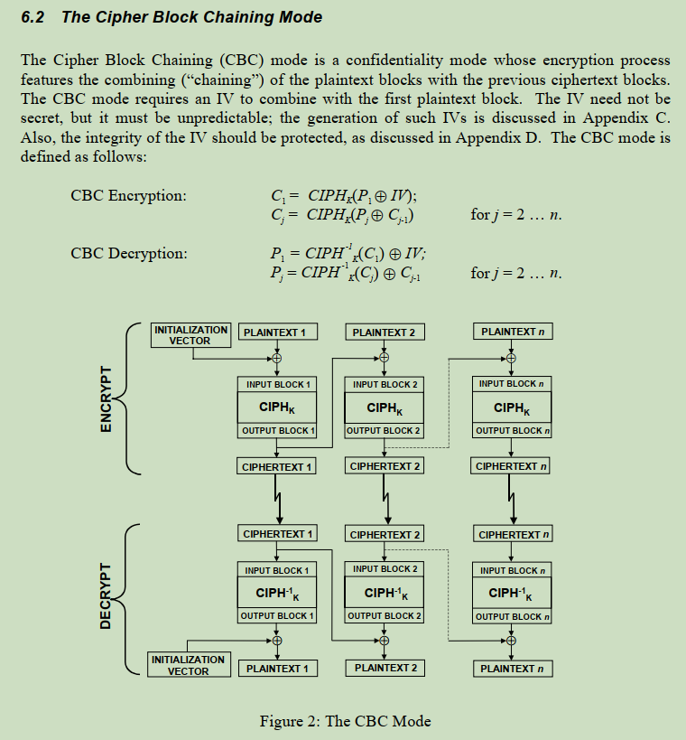
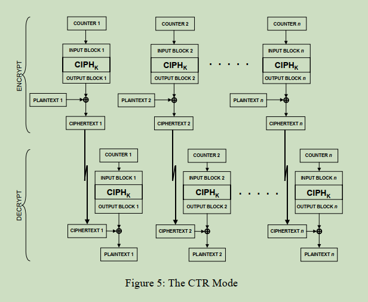
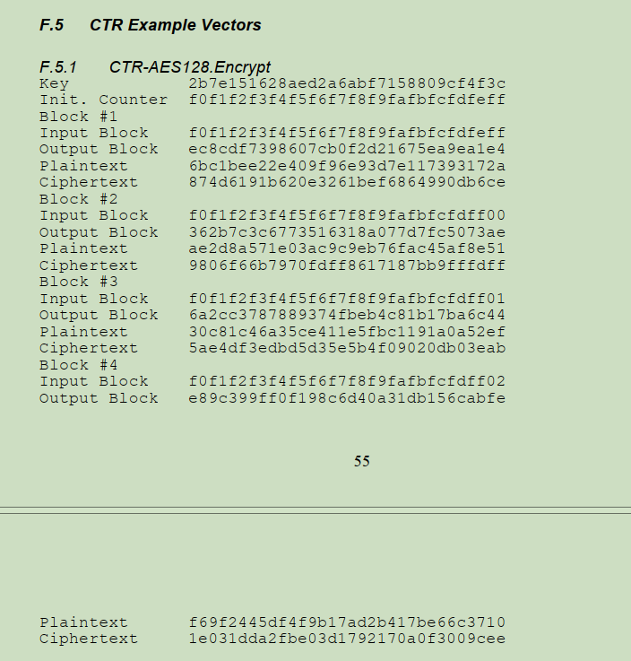

AES 38a
=======

参考文档: <nistspecialpublication800-38a.pdf>

该文档中描述了一些基于AES的分组算法, 分别是

+ Electronic Codebook Mode (ECB, 电子密码本)
+ Cipher Block Chainning Mode (CBC, 密码块链)
+ Cipher FeedBack mode (CFB, 加密反馈)
+ Output FeedBack mode (OFB, 输出反馈)
+ Counter Mode (CTR, 计数器模式)

我们的代码 [aes.c](./aes.c) 选取了 ECB, CBC, CTR 模式进行分析.

# ECB (电子密码本)

ECB 是一种最简单的方式, 将原始数据按照16字节进行拆分, 并各自进行加密.

按照 AES 算法, 使用秘钥 0x000102030405060708090a0b0c0d0e0f 对数据
0x00112233445566778899aabbccddeeff 进行加密, 可以算出加密的数据是
69c4e0d86a7b0430d8cdb78070b4c55a

```console
$ ./aes.out --cipher \
        --key 0x000102030405060708090a0b0c0d0e0f \
        0x00112233445566778899aabbccddeeff
69c4e0d86a7b0430d8cdb78070b4c55a
```

这样我们可以知道数据
0x00112233445566778899aabbccddeeff00112233445566778899aabbccddeeff 按照同样的秘钥
进行解密的密文是两个 69c4e0d86a7b0430d8cdb78070b4c55a

ECB这种模式可以将数据拆分后, 多处理器并行计算, 加快加密速度, 但是因为其块与块之间没什么
相互联系, 所以目前不怎么建议使用这种方式.

# CBC (密码块链)

CBC算法将明文按照16字节大小拆分成若干块, 在进行加密之前先将当前块的明文数据异或上一块
的加密数据. 因 Plaintext1 没有上一块, 所以 Plaintext 会异或一个指定的 Initalization
Vector(简称IV). 既然 Plaintext1 是 16 字节, 那 IV 自然也是 16 字节.



简单的实现如下:

```c
static int aes_cbc(AES_KEY *key, const uint8_t *in, size_t inlen,
		   const uint8_t *iv, uint8_t *out)
{
	uint8_t plaintext[AES_BLOCK_SIZE], v[AES_BLOCK_SIZE];

	memcpy(v, iv, AES_BLOCK_SIZE);

	for (size_t i = 0; i < inlen; i += AES_BLOCK_SIZE) {
		memcpy(plaintext, &in[i], AES_BLOCK_SIZE);
		aes_block_data_xor(plaintext, v);
		AES_encrypt(plaintext, v, key);

		memcpy(&out[i], v, AES_BLOCK_SIZE);
	}

	return inlen;
}
```

这样的算法给相邻的数据块增加了一定的关联, 也就是名字中的 Chainning.

# CTR (计数器模式)

同样的先将明文数据按照 16 字节大小进行拆分, 然后选择 Counter, 每计算一个块,
counter 增加 1.

CTR 模式是对 Counter 进行 AES 加密, 那自然 Counter 的长度是 16 字节, 之后将 Counter
加密后的数据对每一块的明文数据计算异或, 异或的结果就是最终的 cipher.



通过这个加密流程, 可以看到 CTR 的加密与解密流程相同. 将密文按照同样的流程异或一遍可以
得到明文.

```c
static int aes_ctr(AES_KEY *key, const uint8_t *in, size_t inlen,
		   const uint8_t *iv, uint8_t *out)
{
	uint8_t counter[AES_BLOCK_SIZE], cipher[AES_BLOCK_SIZE];

	memcpy(counter, iv, AES_BLOCK_SIZE);

	for (size_t i = 0; i < inlen; i += AES_BLOCK_SIZE) {
		AES_encrypt(counter, cipher, key);
		aes_block_data_xor(cipher, &in[i]);
		memcpy(&out[i], cipher, AES_BLOCK_SIZE);

		aes_block_data_add(counter, 1);
	}

	return inlen;
}
```

当选定了 counter 的数值之后, 可以对数据进行并行处理, 能够加快加解密的速度.



