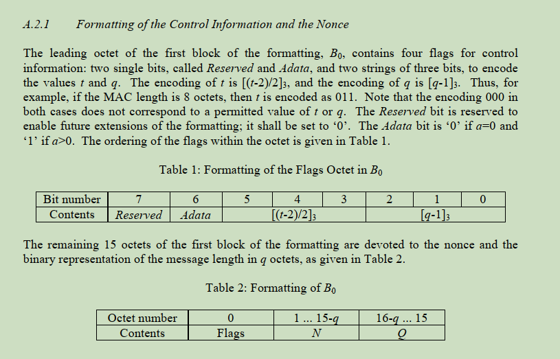
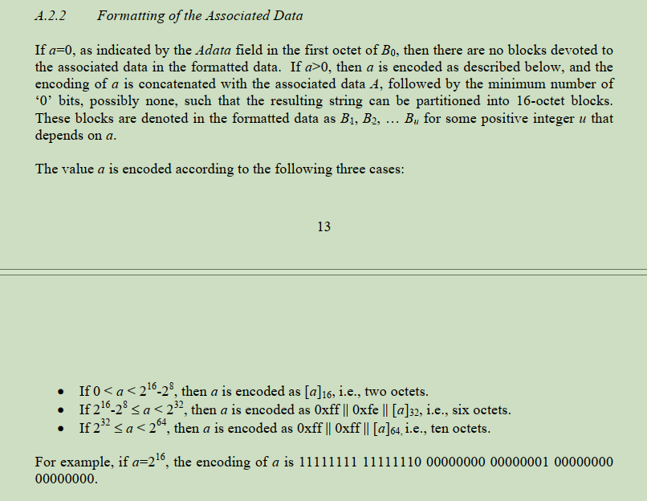
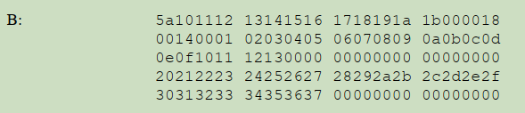
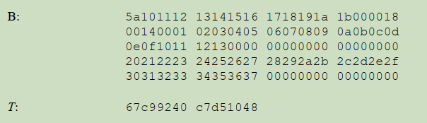
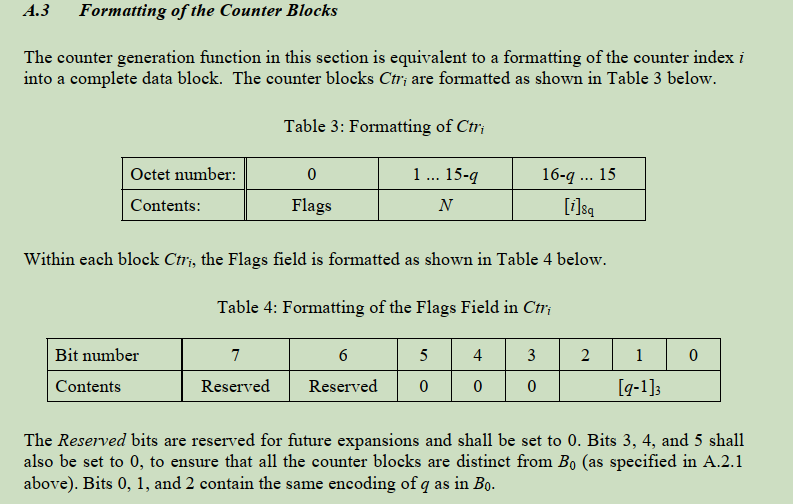
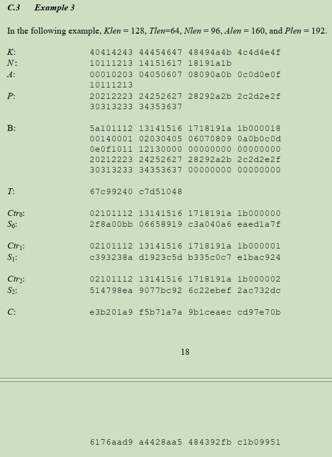

AES 38c
=======

参考文档: <nistspecialpublication800-38c.pdf>

这个文档中介绍了一个算法:

Counter with Cipher Block Chainning-Message Authentication Code(CCM)

从算法的名字上可以看出:

1. 使用了 Counter
2. 使用了 CBC 算法
3. 算法输出 MAC (Message Authentication Code)

不同于其他简单的算法, CCM 的输入参数要更多一些. 按照文档 C.3 Example 3 进行说明.

| 符号 | 定义                                  |                                                       |
| ---- | ------------------------------------- | ----------------------------------------------------- |
| K    | 秘钥                                  | 40414243 44454647 48494a4b 4c4d4e4f                   |
| N    | Nonce随机数, 字节个数在 [7,13]之间    | 10111213 14151617 18191a1b                            |
| A    | The associated data string.  任意字节 | 00010203 04050607 08090a0b 0c0d0e0f 10111213          |
| P    | 明文数据                              | 20212223 24252627 28292a2b 2c2d2e2f 30313233 34353637 |
| Tlen | 需要生成的MAC的比特数.                | 64                                                    |

CCM 的算法分两大步, 第一部分用于生成MAC, 第二部分进行加密.

```

Tlen ---------\
Nonce ---------\
                \
Adata ------------- [AES KEY] ---> MAC -------------------\
               /                                           \
Plaintext ----/                                             \
                                                             \
                                                              \
Nonce ---> CTRn ----> [AES KEY] --> S --\                      \
                                         (+) -> Cipher[n] -----/ ==> cipher
plaintextn -----------------------------/

```

# A.2 Formatting of the Input Data

CCM 有许多输入参数, 文档中定义了一种规则, 用于打包这些输入参数.

## A.2.1 Formatting of the Control Information and the Nonce

几个变量的解释:

| 变量 | 定义                                                     |
| ---- | -------------------------------------------------------- |
| t    | Tlen / 8, MAC的字节个数                                  |
| n    | Nonce的字节个数, 取值范围是 [7, 13]                      |
| q    | 用多少字节存储 payload(plaintext)的长度, 满足 n + q = 15 |
| Q    | payload(plaintext)的字节数                               |



在 Example 3 中:

```
t = 64 / 8 = 8
n = 12
q = 15 - 12 = 3
Q = 24 = 0x18

=>

(t - 2) / 2 = 3
q - 1 = 2
```

并且输入参数中带有 Adata, 因此组成的 flags 字节是:

```
bit idx: 7  6  5  4  3  2  1  0
-------------------------------
bit val: 0  1  0  1  1  0  1  0
```

所以 B0.flags 字节是 0x5a.

将 B0.flags, N, Q 组合成 16 字节 B0 如下:

```
5a 101112131415161718191a1b 000018
```

## A.2.2 Formatting of the Associated Data

格式化 Adata 比较简单, 前面添加 Adata 的长度, 后面填充 Adata, 并补齐 0 到 16 字节
对齐.



这个例子中, Adata 共计 20(0x14) 字节, 因此格式化数据如下:

```
00140001 02030405 06070809 0a0b0c0d
0e0f1011 12130000 00000000 00000000
```

## A.2.3 Formatting of the payload

格式化 payload 数据比较简单, 只要填充 0 到 16 字节对齐即可.

```
20212223 24252627 28292a2b 2c2d2e2f
30313233 34353637 00000000 00000000
```

之后将上面格式化的三部分组合起来, 就完成了格式化输入数据:



# 计算 MAC

将格式化的 B 按照 CBC 算法计算, 取最后一次的 cipher, 并按照 Tlen 裁剪即可得到我们需要
的 MAC (IV 取 0x0, 并且手动对输出进行16字节换行)

```console
$ ./aes.out --cbc \
        --key "0x40414243 44454647 48494a4b 4c4d4e4f" \
        --iv "0x00000000000000000000000000000000" \
        "0x5a 101112131415161718191a1b 000018 \
        00140001 02030405 06070809 0a0b0c0d \
        0e0f1011 12130000 00000000 00000000 \
        20212223 24252627 28292a2b 2c2d2e2f \
        30313233 34353637 00000000 00000000"
a72f566cfdf02e0cc9fd2e5a7ec8dc2d
c1429ed7c76185e3d1b720b14ce8bf82
a9509e3b58cca9c4d855be308a60f2d1
8f634eb82ac15581490194cdf74b711e
67c99240c7d51048b4c9bcec10ae0215
```

按照 Tlen 裁剪最后一次的 cipher, 可以得到:

```
67c99240c7d51048
```



# 数据加密

从算法的名字上也能看出使用了 Counter, 我们需要生成一个 16  字节的 Counter:



在之前我们已经知道 `q=3`, 因此根据这个格式化方式生成 CTRi:

CTRi.flags = 0x02

        CTRi = "0x02101112131415161718191a1b000000" + i

将对齐之后 payload 按照 AES-CTR 算法进行加密, 初始化 counter 选择 CTR1.

```console
$ ./aes.out --ctr \
        --key "0x40414243 44454647 48494a4b 4c4d4e4f" \
        --iv "0x02101112131415161718191a1b000001" \
        "0x20212223 24252627 28292a2b 2c2d2e2f \
        30313233 34353637 00000000 00000000"
e3b201a9f 5b71a7a 9b1ceaec cd97e70b
6176aad9 a4428aa5 6c22ebef 2ac732dc
```

补齐之前的数据长度是 20 字节, 因此 CTR 的结果取前 20 字节:

```
e3b201a9f 5b71a7a 9b1ceaec cd97e70b
6176aad9 a4428aa5
```

之后再加密数据之后添加 S0 ^ MAC 的结果(16 字节) 作为总的加密数据.
其中 `S0 = CIPHER(CTR0)`

我们在 [aes.c](./aes.c) 中手动实现了 CCM 算法, 将数据输入之后可以得到加密后的结果:

```console
$ ./aes.out \
	--ccm --Tlen 64 \
	--key '0x40414243 44454647 48494a4b 4c4d4e4f' \
	--nonce '0x10111213 14151617 18191a1b' \
	--adata '0x00010203 0405060708090a0b 0c0d0e0f 10111213' \
	'0x20212223 24252627 28292a2b 2c2d2e2f 30313233 34353637'
e3b201a9f5b71a7a9b1ceaeccd97e70b6176aad9a4428aa5484392fbc1b09951
```


