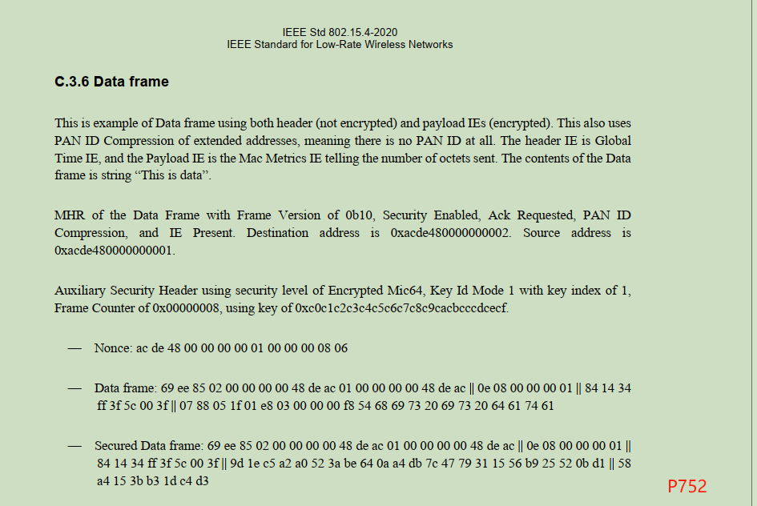
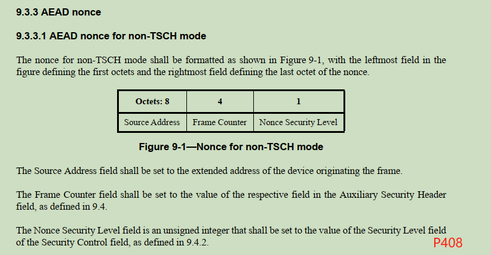
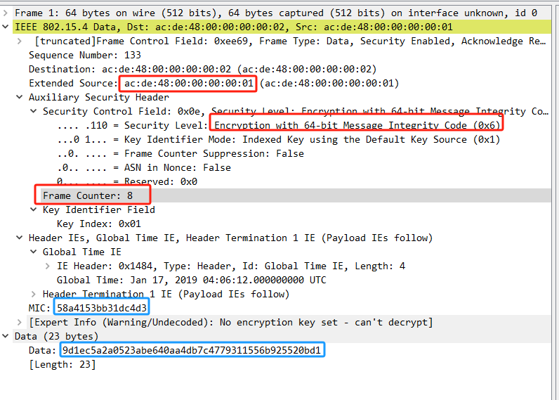

IEEE802.15.4 AES-128-CCM*
=========================

参考文档: <ieee 802.15.4-2020.pdf>

IEEE 802.15.4 规范中描述了 AES-128-CCM* 算法, 用于对数据进行加密, 从我的测试情况来看
暂时没发现这个算法与标准的 AES-128-CCM 的明显区别. 下面看下 802.15.4 是如何构造 CCM
算法所需要的 `Nonce` 和 `Adata` 的.

在文档的 C.3.6 一节有一个加密的示例:



Data frame 是待处理的数据帧, 在 `07 88 05 1f ... 74 61` 之前的数据是包头部分, 不能
被加密, 需要加密的数据是 `07 88 05 1f ... 74 61`.

`Secured Data frame` 部分是处理之后的报文, 按照 CCM 的算法, 并在之后添加了 64 比特
的 MIC.

我做了一个工具 [import_wireshark](../wireshark/import_wireshark.c) 用于将报文数据
存储到 wireshark 的 pcapng 文件中, 通过 wireshark 帮助我们解析.

```console
$ ./import_wireshark.out \
        "69ee85020000000048deac010000000048deac|| \
        0e0800000001|| \
        841434ff3f5c003f|| \
        9d1ec5a2a0523abe640aa4db7c4779311556b925520bd1|| \
        58a4153bb31dc4d3" > 2.pcapng
```

按照 802.15.4 规范中的定义, Nonce 的生成规则如下:



通过 wireshark 查看解析的数据:



# 计算验证

按照 AEAD 的规则, 生成的 Nonce 为

        0xacde480000000001:00000008:06

上面也看到整个数据包中仅有一小部分是需要加密处理的, 如果我们仅按照一个算法对部分数据进行
加密, 无法阻止其他恶意程序对明文部分的修改, 这样即使我们做了加密, 数据依旧是不可信的.
因此需要对明文部分的数据做一个MAC验证.

参考 AES-CCM 的算法定义, MAC 验证码是通过 Tlen, Nonce, Adata, Plaintext 整体计算
出来的. 如果我们将数据帧的明文部分塞到 Adata 中, 那所有的数据都能够被验证了. 整理出
Adata 数据:

```
0x69ee85020000000048deac010000000048deac||0e0800000001||841434ff3f5c003f
```

需要注意的是, Adata 部分不应包含加密的明文部分, 因为 AES-CCM 算法做 MAC 校验的时候,
会自动增加解密的明文部分重新计算 MAC:

```c
static int aes_invccm(AES_KEY *cipher_key,
		      const uint8_t *in, size_t inlen, int Tlen,
		      const uint8_t *nonce, size_t nonce_sz,
		      const uint8_t *adata, size_t adata_sz,
		      uint8_t *out)
{
	uint8_t ctr[AES_BLOCK_SIZE] = { 0 }, S0[AES_BLOCK_SIZE];
	uint8_t T[AES_BLOCK_SIZE];
	int t = Tlen / 8, q = 15 - nonce_sz;
	size_t plaintext_sz = inlen - t;

	/* Step1: If Clen <= Tlen, then return INVALID */
	if (inlen <= t)
		return -1;

	ctr[0] = (q - 1);
	memcpy(&ctr[1], nonce, nonce_sz);
	AES_encrypt(ctr, S0, cipher_key);
	aes_block_data_add(ctr, 1);

	/* The decrypt work is done after AES-CTR */
	aes_ctr(cipher_key, in, aligned_roundup(plaintext_sz, AES_BLOCK_SIZE),
		ctr, out);

	/* And then verify MAC by using the plaintext */
	aes_ccm_gen_T(cipher_key, out, plaintext_sz, Tlen, nonce, nonce_sz,
		      adata, adata_sz, T);
	aes_block_data_xor(T, S0);

	return memcmp(&in[inlen - t], T, t) ? -1 /* failed */ : plaintext_sz;
}
```

输入参数整理完毕, 测试下解密结果:

```console
$ ./aes.out --invccm \
        --Tlen 64 \
        --key '0xc0c1c2c3c4c5c6c7c8c9cacbcccdcecf' \
        --nonce '0xacde480000000001:00000008:06' \
        --adata '0x69ee85020000000048deac010000000048deac||0e0800000001||841434ff3f5c003f' \
        '0x9d1ec5a2a0523abe640aa4db7c4779311556b925520bd1||58a4153bb31dc4d3'
0788051f01e803000000f8546869732069732064617461
```
