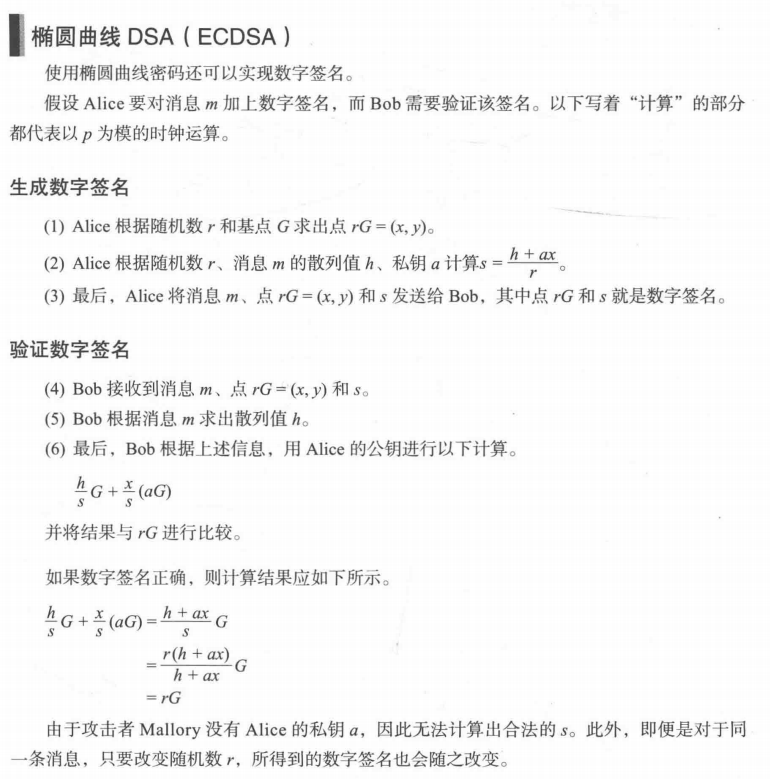

椭圆算法
=======

生成秘钥对:

```console
$ openssl ecparam -genkey -name prime256v1 -out key.pem \
        -writerand key.rand \
        -C
$ openssl ec -in key.pem -pubout -out pubkey.pem

$ openssl ec -in key.pem -noout -text
read EC key
Private-Key: (256 bit)
priv:
    ea:e0:00:6f:a5:f8:28:2d:1d:7a:a0:27:26:a9:70:
    03:32:34:16:7d:03:ff:7c:6f:49:61:fd:a1:6b:79:
    e7:67
pub:
    04:ac:35:66:28:06:76:ad:fd:a6:16:6d:19:5f:97:
    eb:91:31:21:6a:4e:a7:5c:d6:d5:c0:54:4f:34:c6:
    88:97:d0:86:08:8f:0e:aa:00:d4:83:18:27:0e:1a:
    70:7a:9b:6f:94:e8:82:d6:f2:b3:f7:d7:b9:37:1b:
    bc:ae:43:ab:54
ASN1 OID: prime256v1
NIST CURVE: P-256

$ openssl ec -in pubkey.pem -pubin -text -noout
read EC key
Public-Key: (256 bit)
pub:
    04:ac:35:66:28:06:76:ad:fd:a6:16:6d:19:5f:97:
    eb:91:31:21:6a:4e:a7:5c:d6:d5:c0:54:4f:34:c6:
    88:97:d0:86:08:8f:0e:aa:00:d4:83:18:27:0e:1a:
    70:7a:9b:6f:94:e8:82:d6:f2:b3:f7:d7:b9:37:1b:
    bc:ae:43:ab:54
ASN1 OID: prime256v1
NIST CURVE: P-256
```

# 公钥生成

使用 openssl 提供的函数接口, 写了一个 ec 的乘法器: [ec.c](../ec.c), 用于计算指定椭圆
曲线上 `n * G + m * {q}` 的坐标:

```
Usage: ec.out curve_name [-n n] [-m m] [-qx, -qy]
       The result will be
              generator * n + {q} * m
       q is an optional, default is generator(G)
```

按照椭圆曲线的定义, 公钥就是私钥乘以 G(基点):

```console
$ ./ec.out prime256v1 \
        -n 0xeae0006fa5f8282d1d7aa02726a970033234167d03ff7c6f4961fda16b79e767
(0xAC3566280676ADFDA6166D195F97EB9131216A4EA75CD6D5C0544F34C68897D0, 0x86088F0EAA00D48318270E1A707A9B6F94E882D6F2B3F7D7B9371BBCAE43AB54)
```

我们计算出的公钥与 `openssl ec` 输出的公钥相比, 少了第一个字节 `04`, 之后的数据是
相同的. 第一个字节是一个压缩标志, 因为根据固定的椭圆曲线, 给出 x 的坐标能够求出 y
的坐标, 所以可以将 `y` 坐标省略传递. 如果压缩标志是 `04` 表示后续的数据未经压缩.

# ECDH: 基于椭圆曲线的 Diffie-Hellman 秘钥交换

式中的 P 表示椭圆的基点.


以 prime256v1 这条曲线为例, 椭圆曲线的参数以及基点都已经被定义, 假设 Alice 生成的秘钥
是 `a=0x11223344`, Bob 生成的秘钥是 `b=0x44332211`.

Alice 计算的 A 的数值是:

```console
$ ./ec.out prime256v1 -n 0x11223344
(0x2021568AAABD087BAED3991B22C3376F39150C43AD3C24CF66716EB4E202F45F, 0xAE07ED3D80AE1B5D25EB3D97749EDE238BD4B8C55CB5B1809E18D7EE19AF0244)
```

Bob 计算的 B 的数值是:

```console
$ ./ec.out prime256v1 -n 0x44332211
(0x1D93C767FF1FB260349E682E9FEE1F88DF577287738A9F6EC250D07AA27AB251, 0x29D1A73BAF4DAAFFCCC3C91C75BF23066CC615AEF80CAEF34B435E694ED94DBF)
```

于是 Alice 将自己计算的 A 传递给 Bob, Bob 使用 `b * A` 计算出他们的联合秘钥:

```console
$ ./ec.out prime256v1 -m 0x44332211 \
        -X 0x2021568AAABD087BAED3991B22C3376F39150C43AD3C24CF66716EB4E202F45F \
        -Y 0xAE07ED3D80AE1B5D25EB3D97749EDE238BD4B8C55CB5B1809E18D7EE19AF0244
(0xC59FDA7D675FEF43EBE4B3E286D96A94B317B9A357EA8893F90163E6D1D1D36E, 0xAB9D1DA5CB801BD7D6C96122027C3A9284FBD171FD7508EFD376BD2BC23E877E)
```

当 Alice 收到 B 之后, 可以按照 `a * B` 也计算出他们的联合秘钥.

```console
$ ./ec.out prime256v1 -m 0x11223344 \
        -X 0x1D93C767FF1FB260349E682E9FEE1F88DF577287738A9F6EC250D07AA27AB251 \
        -Y 0x29D1A73BAF4DAAFFCCC3C91C75BF23066CC615AEF80CAEF34B435E694ED94DBF
(0xC59FDA7D675FEF43EBE4B3E286D96A94B317B9A357EA8893F90163E6D1D1D36E, 0xAB9D1DA5CB801BD7D6C96122027C3A9284FBD171FD7508EFD376BD2BC23E877E)
```

可以看到两边计算出的坐标值是相同的. 对第三方而言, 其只能知道 `A` 和 `B` 的数值, 无法
知道通信生成的 `a` 和 `b` 的数值, 因此其无法计算出联合秘钥.

# ECDSA: 基于椭圆曲线的数字签名

使用 `echo abc > 1.txt` 创建一个测试文件.

通过私钥创建签名文件, 并通过公钥验证:

```console
$ openssl dgst -sha256 -sign key.pem 1.txt > sign.bin
$ openssl dgst -sha256 -verify pubkey.pem -signature sign.bin 1.txt
Verified OK
```

根据 <图解密码技术 第三版> 中的介绍, ECDSA 的计算如下:



从公式上看, 数字签名就是 r 和产生的 s 两个数字. 使用 `openssl asn1parse` 查看签名
文件, 可以从中看到两个大数, 第一个是 r, 第二个是 s.

```console
$ openssl asn1parse -inform DER -in sign.bin
    0:d=0  hl=2 l=  69 cons: SEQUENCE
    2:d=1  hl=2 l=  32 prim: INTEGER           :112E4A82796DB59828127861E736FD01819B28574475F4451075DEC287EC6714
   36:d=1  hl=2 l=  33 prim: INTEGER           :CBE6AFDC7D415F58D94D219AF3F4357274D0B701899FC0DAAF89828BC0AFB93B
```

