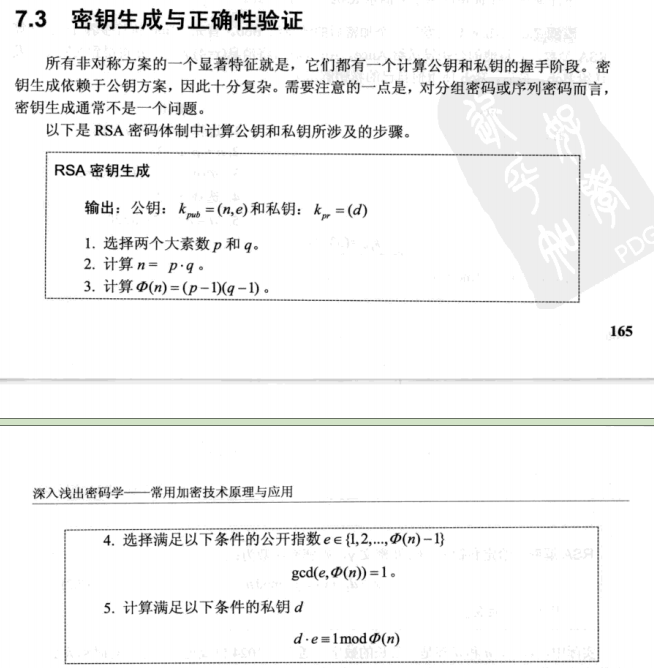
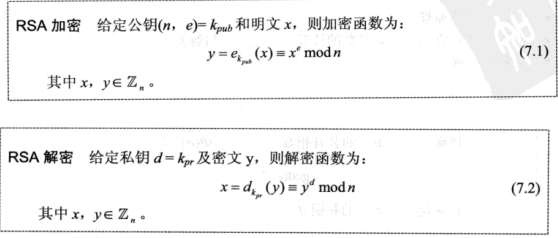

创建RSA证书和秘钥
================

参考文档:

https://djangocas.dev/blog/openssl-tls-ssl-certificate-csr-s_server-s_client-examples

生成秘钥:

```console
$ openssl req -new \
    -newkey rsa:2048 -nodes -keyout key.pem \
    -out cert.csr \
    -subj "/C=US/ST=FL/L=Orlando/O=Foo LLC/OU=IT/CN=www.example.com"
```

使用 `openssl req` 验证 Certificate Signing Request (CSR):

```console
$ openssl req -verify -in cert.csr -text -noout
verify OK
Certificate Request:
    Data:
        Version: 1 (0x0)
        Subject: C = US, ST = FL, L = Orlando, O = Foo LLC, OU = IT, CN = www.example.com
        Subject Public Key Info:
            Public Key Algorithm: rsaEncryption
                RSA Public-Key: (2048 bit)
                Modulus:
                    00:9c:40:5a:08:d2:7a:a2:5b:a0:bf:57:1b:ff:0c:
                    ea:80:60:34:ee:cb:e0:63:58:d1:31:98:c5:c9:ea:
                    d7:b3:d7:ab:17:2b:46:24:fd:d0:4f:9a:b1:ac:af:
                    d4:f1:9e:8d:d3:ea:8f:db:c9:09:6c:48:a2:c1:53:
                    e7:a4:a2:9d:13:df:52:1b:6b:3e:c8:bb:9e:b4:00:
                    b4:7a:71:06:f7:d3:bb:d1:cb:be:54:b3:da:75:1d:
                    20:9c:c4:51:20:f9:e6:16:cb:26:41:d2:65:c1:73:
                    a5:a0:c3:da:32:17:08:b0:04:1a:fa:dc:6e:8e:b0:
                    41:c9:93:4a:3f:c2:7f:b8:d1:36:4f:80:5b:89:49:
                    bd:7e:91:c8:65:15:3a:c7:54:48:92:9d:09:f2:04:
                    b0:d3:91:2d:15:b8:6f:ea:13:f6:5f:6a:7f:b4:cc:
                    d2:b4:3e:31:26:de:d5:4c:45:e7:71:f0:cf:57:51:
                    5e:9c:9f:d4:78:29:63:e0:10:a9:7c:26:fa:e8:42:
                    48:8b:fc:73:31:fc:d5:96:59:01:40:8e:ce:15:c4:
                    cf:b6:d5:b4:30:d9:bf:ab:b0:3d:3a:27:55:9c:59:
                    ba:a1:69:c6:2b:0d:76:f9:8c:b7:32:9d:a9:a2:84:
                    d9:db:79:b9:e0:59:f2:69:3a:2b:93:62:d9:67:78:
                    cb:f3
                Exponent: 65537 (0x10001)
        Attributes:
            a0:00
    Signature Algorithm: sha256WithRSAEncryption
         22:e0:a6:45:86:cf:d5:b8:4b:e9:d7:e4:ce:c1:3f:8c:41:a4:
         bd:9b:a3:5a:4a:8e:69:d9:2d:43:db:43:45:b9:64:c4:6f:e1:
         bc:b5:12:3c:20:2a:e6:c8:71:42:8b:e4:09:c7:ba:42:01:21:
         0a:5b:50:54:fb:12:ad:6d:db:2f:38:94:2d:9e:6b:25:28:5f:
         bc:b2:1e:05:b0:5d:2d:1c:22:a0:cf:74:4d:28:2f:cc:d8:8f:
         46:e0:33:11:a7:ef:8e:ef:60:33:8c:38:62:e7:a3:56:e3:72:
         0c:f9:0c:9b:a4:86:25:f7:22:84:dc:10:3a:79:3a:c0:31:16:
         ca:32:b5:d6:5d:e6:7d:01:13:f8:4f:38:af:27:3e:e8:ab:a4:
         6d:5d:05:41:b1:fa:95:c1:0c:7d:06:d7:c2:bd:da:de:0c:84:
         05:db:8b:2b:42:50:a3:71:dd:ed:50:19:c1:87:aa:95:18:45:
         61:e8:eb:31:7b:a2:6d:c9:f8:89:7e:e4:88:87:8d:72:c3:24:
         6d:9f:e6:d1:aa:e7:cb:a1:dd:fe:5f:7c:7c:5d:ef:7d:2b:a5:
         34:ab:d6:86:77:07:ad:10:48:a7:2b:30:68:d7:05:72:0e:e6:
         94:24:c7:f0:da:12:9f:d5:9f:8e:78:2e:65:66:51:1e:b5:cc:
         69:e5:6b:be
```

cert.csr 可以送到公共 CA 去签名, 或者自己签名.

```console
$ openssl req -x509 -days 365 -in cert.csr -key key.pem -out cert.pem
$ file cert.pem
cert.pem: PEM certificate
```

查看证书的细节:

```console
$ openssl x509 -text -noout -in cert.pem
Certificate:
    Data:
        Version: 3 (0x2)
        Serial Number:
            4e:5c:7b:9e:34:df:00:1c:71:49:28:31:26:68:49:b4:1a:21:e1:48
        Signature Algorithm: sha256WithRSAEncryption
        Issuer: C = US, ST = FL, L = Orlando, O = Foo LLC, OU = IT, CN = www.example.com
        Validity
            Not Before: Dec 12 09:41:38 2023 GMT
            Not After : Dec 11 09:41:38 2024 GMT
        Subject: C = US, ST = FL, L = Orlando, O = Foo LLC, OU = IT, CN = www.example.com
        Subject Public Key Info:
            Public Key Algorithm: rsaEncryption
                RSA Public-Key: (2048 bit)
                Modulus:
                    00:9c:40:5a:08:d2:7a:a2:5b:a0:bf:57:1b:ff:0c:
                    ea:80:60:34:ee:cb:e0:63:58:d1:31:98:c5:c9:ea:
                    d7:b3:d7:ab:17:2b:46:24:fd:d0:4f:9a:b1:ac:af:
                    d4:f1:9e:8d:d3:ea:8f:db:c9:09:6c:48:a2:c1:53:
                    e7:a4:a2:9d:13:df:52:1b:6b:3e:c8:bb:9e:b4:00:
                    b4:7a:71:06:f7:d3:bb:d1:cb:be:54:b3:da:75:1d:
                    20:9c:c4:51:20:f9:e6:16:cb:26:41:d2:65:c1:73:
                    a5:a0:c3:da:32:17:08:b0:04:1a:fa:dc:6e:8e:b0:
                    41:c9:93:4a:3f:c2:7f:b8:d1:36:4f:80:5b:89:49:
                    bd:7e:91:c8:65:15:3a:c7:54:48:92:9d:09:f2:04:
                    b0:d3:91:2d:15:b8:6f:ea:13:f6:5f:6a:7f:b4:cc:
                    d2:b4:3e:31:26:de:d5:4c:45:e7:71:f0:cf:57:51:
                    5e:9c:9f:d4:78:29:63:e0:10:a9:7c:26:fa:e8:42:
                    48:8b:fc:73:31:fc:d5:96:59:01:40:8e:ce:15:c4:
                    cf:b6:d5:b4:30:d9:bf:ab:b0:3d:3a:27:55:9c:59:
                    ba:a1:69:c6:2b:0d:76:f9:8c:b7:32:9d:a9:a2:84:
                    d9:db:79:b9:e0:59:f2:69:3a:2b:93:62:d9:67:78:
                    cb:f3
                Exponent: 65537 (0x10001)
        X509v3 extensions:
            X509v3 Subject Key Identifier:
                08:86:6F:A9:3B:C8:50:0C:78:55:1F:44:77:CD:D0:5D:B5:DA:AF:E5
            X509v3 Authority Key Identifier:
                keyid:08:86:6F:A9:3B:C8:50:0C:78:55:1F:44:77:CD:D0:5D:B5:DA:AF:E5

            X509v3 Basic Constraints: critical
                CA:TRUE
    Signature Algorithm: sha256WithRSAEncryption
         21:39:24:9b:c4:79:c1:07:de:5b:22:43:9d:dd:80:df:86:41:
         0c:eb:1b:d6:b3:5f:30:15:aa:25:6d:5f:17:d3:cc:69:39:a6:
         7f:d6:75:a3:a0:67:4a:55:a2:d7:96:00:a8:45:77:03:ca:e1:
         4a:7c:af:60:c5:1c:31:13:53:5d:ee:af:81:5f:76:82:13:37:
         41:87:76:05:a2:00:15:94:9d:6b:74:0c:3a:a2:d2:97:dc:60:
         59:dc:63:0e:99:7b:cd:9c:9e:fd:77:73:09:d4:b6:f6:44:d8:
         4c:cb:92:39:08:cc:9a:ae:a8:5f:45:08:6a:5d:b8:10:f9:18:
         1c:27:e4:9f:75:a7:ab:96:db:1d:7d:bb:2b:b1:03:56:c4:ec:
         44:fb:f0:7e:29:5b:ab:ee:18:55:ae:cf:d4:ec:aa:fd:a3:87:
         b1:7c:d0:3f:c0:50:48:d7:33:a6:ea:95:6c:31:d1:2e:88:a4:
         49:c3:9d:ec:fd:05:c5:df:a4:ab:c6:af:53:57:0a:b8:48:71:
         a5:8e:c1:6c:46:a2:16:fc:ac:ef:86:7a:bf:bd:4f:59:47:96:
         e0:e0:60:8b:db:50:58:20:f1:56:8b:13:8d:e2:ea:24:9e:39:
         61:73:37:60:7b:ff:ab:b6:6c:55:2d:e4:f9:42:0c:13:f4:02:
         80:0c:14:d9
```

可以比对私钥和签名文件中的 modulus(模) 来判断两者是否匹配.

```
$ openssl x509 -in cert.pem -noout -modulus
Modulus=9C405A08D27AA25BA0BF571BFF0CEA8...
$ openssl rsa -in key.pem -noout -modulus
Modulus=9C405A08D27AA25BA0BF571BFF0CEA8...
```

# 使用 openssl s_server 测试

新建一个终端, 运行 s_server:

```console
$ openssl s_server -accept 4433 -cert cert.pem -key key.pem
Using default temp DH parameters
ACCEPT
```

在另一个终端中运行 s_client, 并连接到 4433 端口:

```console
$ openssl s_client -connect localhost:4433
openssl s_client -connect localhost:4433
CONNECTED(00000003)
Can't use SSL_get_servername
depth=0 C = US, ST = FL, L = Orlando, O = Foo LLC, OU = IT, CN = www.example.com
verify error:num=18:self signed certificate
verify return:1
depth=0 C = US, ST = FL, L = Orlando, O = Foo LLC, OU = IT, CN = www.example.com
verify return:1
---
Certificate chain
 0 s:C = US, ST = FL, L = Orlando, O = Foo LLC, OU = IT, CN = www.example.com
   i:C = US, ST = FL, L = Orlando, O = Foo LLC, OU = IT, CN = www.example.com
---
Server certificate
-----BEGIN CERTIFICATE-----
MIIDqzCCApOgAwIBAgIUTlx7njTfABxxSSgxJmhJtBoh4UgwDQYJKoZIhvcNAQEL
BQAwZTELMAkGA1UEBhMCVVMxCzAJBgNVBAgMAkZMMRAwDgYDVQQHDAdPcmxhbmRv
MRAwDgYDVQQKDAdGb28gTExDMQswCQYDVQQLDAJJVDEYMBYGA1UEAwwPd3d3LmV4
YW1wbGUuY29tMB4XDTIzMTIxMjA5NDEzOFoXDTI0MTIxMTA5NDEzOFowZTELMAkG
A1UEBhMCVVMxCzAJBgNVBAgMAkZMMRAwDgYDVQQHDAdPcmxhbmRvMRAwDgYDVQQK
DAdGb28gTExDMQswCQYDVQQLDAJJVDEYMBYGA1UEAwwPd3d3LmV4YW1wbGUuY29t
MIIBIjANBgkqhkiG9w0BAQEFAAOCAQ8AMIIBCgKCAQEAnEBaCNJ6olugv1cb/wzq
gGA07svgY1jRMZjFyerXs9erFytGJP3QT5qxrK/U8Z6N0+qP28kJbEiiwVPnpKKd
E99SG2s+yLuetAC0enEG99O70cu+VLPadR0gnMRRIPnmFssmQdJlwXOloMPaMhcI
sAQa+txujrBByZNKP8J/uNE2T4BbiUm9fpHIZRU6x1RIkp0J8gSw05EtFbhv6hP2
X2p/tMzStD4xJt7VTEXncfDPV1FenJ/UeClj4BCpfCb66EJIi/xzMfzVllkBQI7O
FcTPttW0MNm/q7A9OidVnFm6oWnGKw12+Yy3Mp2pooTZ23m54FnyaTork2LZZ3jL
8wIDAQABo1MwUTAdBgNVHQ4EFgQUCIZvqTvIUAx4VR9Ed83QXbXar+UwHwYDVR0j
BBgwFoAUCIZvqTvIUAx4VR9Ed83QXbXar+UwDwYDVR0TAQH/BAUwAwEB/zANBgkq
hkiG9w0BAQsFAAOCAQEAITkkm8R5wQfeWyJDnd2A34ZBDOsb1rNfMBWqJW1fF9PM
aTmmf9Z1o6BnSlWi15YAqEV3A8rhSnyvYMUcMRNTXe6vgV92ghM3QYd2BaIAFZSd
a3QMOqLSl9xgWdxjDpl7zZye/XdzCdS29kTYTMuSOQjMmq6oX0UIal24EPkYHCfk
n3Wnq5bbHX27K7EDVsTsRPvwfilbq+4YVa7P1Oyq/aOHsXzQP8BQSNczpuqVbDHR
LoikScOd7P0Fxd+kq8avU1cKuEhxpY7BbEaiFvys74Z6v71PWUeW4OBgi9tQWCDx
VosTjeLqJJ45YXM3YHv/q7ZsVS3k+UIME/QCgAwU2Q==
-----END CERTIFICATE-----
subject=C = US, ST = FL, L = Orlando, O = Foo LLC, OU = IT, CN = www.example.com

issuer=C = US, ST = FL, L = Orlando, O = Foo LLC, OU = IT, CN = www.example.com

---
No client certificate CA names sent
Peer signing digest: SHA256
Peer signature type: RSA-PSS
Server Temp Key: X25519, 253 bits
---
SSL handshake has read 1499 bytes and written 363 bytes
Verification error: self signed certificate
---
New, TLSv1.3, Cipher is TLS_AES_256_GCM_SHA384
Server public key is 2048 bit
Secure Renegotiation IS NOT supported
Compression: NONE
Expansion: NONE
No ALPN negotiated
Early data was not sent
Verify return code: 18 (self signed certificate)
---
---
Post-Handshake New Session Ticket arrived:
SSL-Session:
    Protocol  : TLSv1.3
    Cipher    : TLS_AES_256_GCM_SHA384
    Session-ID: 3BC60D6004074EA3A66478F6C028E078150B83EDAD293E24D80B77BA14F829A7
    Session-ID-ctx:
    Resumption PSK: 5AAEF2F176F026AC30CCD343EB50F95CE1F49A7D9FAD26DB1649D7872A03E302E22F51E6A07D6FCEED732198E3080008
    PSK identity: None
    PSK identity hint: None
    SRP username: None
    TLS session ticket lifetime hint: 7200 (seconds)
    TLS session ticket:
    0000 - 93 55 8e 5d 28 9d 9f f4-82 92 46 bf 95 6c b8 2d   .U.](.....F..l.-
    0010 - 7d 5a 12 03 28 29 64 f2-51 95 2f 85 93 5e 66 1a   }Z..()d.Q./..^f.
    0020 - be af 07 35 eb 92 fb de-6f 57 da cf 9a 53 63 ae   ...5....oW...Sc.
    0030 - 8e dd 1a 4b 50 f5 66 8f-a3 82 84 38 43 18 87 23   ...KP.f....8C..#
    0040 - 27 73 96 81 ef c7 74 cb-5a c9 36 e3 38 dc 81 92   's....t.Z.6.8...
    0050 - ee 74 2d 9a 90 f4 0a 4b-f1 e6 2c 7c a9 74 99 b7   .t-....K..,|.t..
    0060 - 1b 73 28 20 9b 86 be 14-ed 1c ef e0 35 35 c4 bc   .s( ........55..
    0070 - 4c 82 77 a0 47 6d 50 94-5d d6 32 fe 74 13 ce 13   L.w.GmP.].2.t...
    0080 - f1 97 62 02 2b 1a d4 09-9e 76 47 1a c4 0d 2a 9c   ..b.+....vG...*.
    0090 - 54 81 52 16 50 fe 5b ae-3a da 62 04 79 dd f4 1c   T.R.P.[.:.b.y...
    00a0 - 00 54 3a b7 0c 9d a9 86-6f a8 b9 db 36 2f 1d 25   .T:.....o...6/.%
    00b0 - 78 b2 b5 c1 ac 30 8c 62-d7 5e 5b 48 13 8c 87 cd   x....0.b.^[H....
    00c0 - 75 e9 83 18 0d 52 9f 34-19 a8 83 02 0c 8f 78 de   u....R.4......x.

    Start Time: 1702374802
    Timeout   : 7200 (sec)
    Verify return code: 18 (self signed certificate)
    Extended master secret: no
    Max Early Data: 0
---
read R BLOCK
---
Post-Handshake New Session Ticket arrived:
SSL-Session:
    Protocol  : TLSv1.3
    Cipher    : TLS_AES_256_GCM_SHA384
    Session-ID: 13BB0283AD48058D781E2364D3E2E458B59F312231544AEC0968F38885590C67
    Session-ID-ctx:
    Resumption PSK: 0FA448192D450CD18E1439BC67EE6CF41A0D26D80DEF1CA2C2CCFD6E5F06B180D209C8510540263A5BF0A265C0AD8839
    PSK identity: None
    PSK identity hint: None
    SRP username: None
    TLS session ticket lifetime hint: 7200 (seconds)
    TLS session ticket:
    0000 - 93 55 8e 5d 28 9d 9f f4-82 92 46 bf 95 6c b8 2d   .U.](.....F..l.-
    0010 - be 16 33 c8 12 bf ef ab-28 6e bf 85 ea c7 69 5e   ..3.....(n....i^
    0020 - c9 a6 ad 7d a0 e2 d4 7c-fd 8f 07 54 ca 22 3d 50   ...}...|...T."=P
    0030 - dc 14 57 1e ed 8a 3e 19-2a f5 f4 bf 38 c9 f8 c6   ..W...>.*...8...
    0040 - 5c 8f d4 c1 a8 af 26 5d-8e cd bf 6e f5 9d ef ea   \.....&]...n....
    0050 - a0 1b f9 ff e1 61 33 8e-0b a1 55 59 d7 b6 9e 9f   .....a3...UY....
    0060 - 74 25 c0 b5 73 03 d4 85-b4 8a ab 17 ff 9c 7f 33   t%..s..........3
    0070 - 41 6b fd 08 ae 25 c9 89-6c 12 70 d8 21 6d b9 73   Ak...%..l.p.!m.s
    0080 - 47 b0 b2 22 0c 4c 65 71-64 a0 0f af 14 cc cf dc   G..".Leqd.......
    0090 - 76 87 77 c6 56 fb 40 ba-7f 39 a0 d1 9d 0f 87 dc   v.w.V.@..9......
    00a0 - 6c be cc 76 cb be 81 12-4b f4 80 cb 5c 4d bd 81   l..v....K...\M..
    00b0 - fd 1a b4 c9 b4 bc 22 8d-ab df 83 b4 1e 3c 6c 02   ......"......<l.
    00c0 - 6e 4f 3b a4 af 07 c2 4b-e2 d1 b9 c0 0e a3 36 75   nO;....K......6u

    Start Time: 1702374802
    Timeout   : 7200 (sec)
    Verify return code: 18 (self signed certificate)
    Extended master secret: no
    Max Early Data: 0
---
read R BLOCK
```

可以看到能够成功连接服务器. 在客户端和服务器的终端上输入字符并回车, 对方能够正确收到.

# RSA 私钥文件


查看 RSA 私钥的细节:

```console
$ openssl rsa -in key.pem -noout -text
RSA Private-Key: (2048 bit, 2 primes)
modulus:
    00:9c:40:5a:08:d2:7a:a2:5b:a0:bf:57:1b:ff:0c:
    ea:80:60:34:ee:cb:e0:63:58:d1:31:98:c5:c9:ea:
    d7:b3:d7:ab:17:2b:46:24:fd:d0:4f:9a:b1:ac:af:
    d4:f1:9e:8d:d3:ea:8f:db:c9:09:6c:48:a2:c1:53:
    e7:a4:a2:9d:13:df:52:1b:6b:3e:c8:bb:9e:b4:00:
    b4:7a:71:06:f7:d3:bb:d1:cb:be:54:b3:da:75:1d:
    20:9c:c4:51:20:f9:e6:16:cb:26:41:d2:65:c1:73:
    a5:a0:c3:da:32:17:08:b0:04:1a:fa:dc:6e:8e:b0:
    41:c9:93:4a:3f:c2:7f:b8:d1:36:4f:80:5b:89:49:
    bd:7e:91:c8:65:15:3a:c7:54:48:92:9d:09:f2:04:
    b0:d3:91:2d:15:b8:6f:ea:13:f6:5f:6a:7f:b4:cc:
    d2:b4:3e:31:26:de:d5:4c:45:e7:71:f0:cf:57:51:
    5e:9c:9f:d4:78:29:63:e0:10:a9:7c:26:fa:e8:42:
    48:8b:fc:73:31:fc:d5:96:59:01:40:8e:ce:15:c4:
    cf:b6:d5:b4:30:d9:bf:ab:b0:3d:3a:27:55:9c:59:
    ba:a1:69:c6:2b:0d:76:f9:8c:b7:32:9d:a9:a2:84:
    d9:db:79:b9:e0:59:f2:69:3a:2b:93:62:d9:67:78:
    cb:f3
publicExponent: 65537 (0x10001)
privateExponent:
    6c:27:32:ea:d6:5d:e2:51:d0:13:81:45:34:a6:89:
    0e:f1:08:d2:9d:b6:24:ae:0e:a6:e8:db:47:27:51:
    c4:ff:2c:42:ee:46:30:46:ab:50:de:7f:cb:4b:2d:
    f7:4c:cb:58:fb:0c:36:92:91:fe:2c:cc:d3:4a:b3:
    95:46:a5:b9:62:a3:df:ac:bd:19:8e:9c:8c:75:cc:
    76:d0:13:85:a9:3e:61:3a:48:f5:32:44:ad:39:cb:
    20:17:d7:1c:1f:3d:bf:5b:40:90:e1:04:64:02:1b:
    8c:0a:e4:d6:35:11:63:5c:84:1c:4e:46:0c:68:3e:
    31:3b:cd:72:12:bb:fb:7d:67:db:96:4f:6b:9f:b0:
    3c:ad:73:82:d3:75:c4:4a:13:29:04:51:74:71:0d:
    29:49:26:fd:22:50:80:a5:cf:54:b8:51:5f:31:1f:
    85:22:7b:2e:50:02:af:61:45:90:9c:6f:a7:7d:98:
    a1:fd:6b:31:0a:d4:22:7c:39:ac:7a:4d:a4:33:0a:
    92:aa:c3:64:52:69:79:f9:16:03:de:e3:d7:30:54:
    a8:29:96:40:d5:00:88:6d:a6:6f:bf:50:67:de:ea:
    23:3b:4f:8c:44:c9:d3:1f:2b:8a:09:e4:f6:12:9f:
    43:3c:bf:db:6e:3f:59:18:01:4f:01:d8:42:9c:af:
    b1
prime1:
    00:c9:6d:f5:07:ce:99:28:4c:fc:9d:65:c8:a0:2b:
    18:ef:2e:a5:47:ec:c9:26:53:5c:dd:35:d5:37:12:
    4e:3e:bc:13:87:3a:57:f9:39:1f:61:ee:97:63:10:
    1c:1e:6e:c7:61:1d:3d:e4:9e:0d:d1:29:0c:fc:e2:
    03:98:8b:87:b4:7e:5e:23:74:22:16:a4:5a:61:aa:
    83:59:12:c4:10:b6:f5:6e:3d:e0:e9:f1:b3:9e:02:
    06:21:60:fc:f9:2b:e4:b6:c3:c3:5a:3d:45:17:af:
    09:28:1f:b5:b8:d7:03:12:10:0d:ad:92:81:e5:b6:
    5b:83:ab:10:d5:3e:2d:22:69
prime2:
    00:c6:95:16:44:45:bf:51:82:bf:51:33:87:5b:fc:
    bd:6b:ab:39:50:70:11:e6:9f:06:d1:bc:f2:a2:d9:
    1a:37:2f:b8:6e:57:c2:1b:dc:c5:ec:b6:96:7b:48:
    e6:8a:07:04:29:08:b1:f9:b4:c4:21:71:26:d0:36:
    0f:35:b2:64:95:58:34:e8:8c:12:0f:ac:57:5b:91:
    64:0e:5a:2d:74:82:27:4c:b3:bd:e5:08:8a:d4:64:
    30:1f:5f:87:9f:5b:76:43:21:fd:1c:4f:18:52:3e:
    7e:5a:1a:a2:8e:30:48:6b:5c:db:6f:b0:39:61:c9:
    96:83:b4:8a:a8:3e:c7:b7:fb
exponent1:
    63:a6:58:40:62:7e:f6:a7:0f:9a:36:8e:88:5e:89:
    d9:5a:34:3e:5e:f0:2c:5b:b5:67:62:88:76:d4:41:
    8d:5b:b2:35:86:31:9b:84:1c:f8:6f:f6:c8:f5:61:
    53:d4:ee:22:27:3b:45:6c:c3:dd:23:f7:de:eb:59:
    68:10:2f:34:a6:07:a0:76:85:9e:b9:f4:54:b8:ec:
    7e:16:80:94:dc:4e:93:19:5d:b9:9e:ef:83:4d:f1:
    06:76:5a:f0:52:3c:b6:06:27:10:ef:9a:cc:da:b5:
    26:fa:79:06:56:a8:98:39:04:eb:47:bd:a7:8d:0d:
    bd:17:d6:1e:08:c2:7f:71
exponent2:
    00:9a:46:cb:24:c1:57:10:59:56:8f:1c:4c:45:df:
    c5:bd:77:29:b0:df:50:58:ee:25:5b:1e:c3:16:57:
    3a:71:b3:66:42:7b:75:77:35:fe:a2:97:7b:b3:4e:
    00:a5:2d:2c:43:40:d9:1c:19:1e:e2:a8:48:b2:2b:
    bd:87:47:0f:b3:a2:f2:7f:d4:0a:58:18:d9:49:6f:
    5b:df:76:99:a7:d1:51:fc:da:0b:66:7b:4b:78:14:
    59:fa:95:ba:04:c9:06:c8:c3:08:24:4d:22:a5:0a:
    9e:19:1c:66:3b:b7:31:1c:0f:e8:ff:0d:56:97:2d:
    08:fd:4b:6f:09:a4:b4:7e:af
coefficient:
    00:90:4b:33:b7:d5:91:be:60:9f:4d:09:5b:36:23:
    b5:8a:ae:0f:23:83:c1:9e:95:2c:24:8e:00:44:a9:
    c3:3f:4b:db:6b:e2:44:6e:93:9b:1e:76:1b:52:2b:
    92:28:28:ad:ba:5b:b3:67:81:1d:0c:50:01:92:90:
    19:a3:8e:11:c1:f1:fc:3b:0b:7f:f2:f1:74:ff:04:
    2d:9b:58:56:82:f3:fe:ff:09:91:0f:76:05:4f:3b:
    95:f8:cb:7b:a1:4f:f3:12:04:85:61:ef:95:02:4d:
    5a:7e:9b:2f:70:15:81:47:c8:3d:26:ee:03:1a:23:
    8e:8a:bc:e2:93:16:28:39:e8
```

# RSA 公钥文件

可以通过 `openssl rsa` 命令生成公钥:

```console
$ openssl rsa -in key.pem -pubout -out pubkey.pem
$ openssl rsa -pubin -in pubkey.pem -text -noout
RSA Public-Key: (2048 bit)
Modulus:
    00:9c:40:5a:08:d2:7a:a2:5b:a0:bf:57:1b:ff:0c:
    ea:80:60:34:ee:cb:e0:63:58:d1:31:98:c5:c9:ea:
    d7:b3:d7:ab:17:2b:46:24:fd:d0:4f:9a:b1:ac:af:
    d4:f1:9e:8d:d3:ea:8f:db:c9:09:6c:48:a2:c1:53:
    e7:a4:a2:9d:13:df:52:1b:6b:3e:c8:bb:9e:b4:00:
    b4:7a:71:06:f7:d3:bb:d1:cb:be:54:b3:da:75:1d:
    20:9c:c4:51:20:f9:e6:16:cb:26:41:d2:65:c1:73:
    a5:a0:c3:da:32:17:08:b0:04:1a:fa:dc:6e:8e:b0:
    41:c9:93:4a:3f:c2:7f:b8:d1:36:4f:80:5b:89:49:
    bd:7e:91:c8:65:15:3a:c7:54:48:92:9d:09:f2:04:
    b0:d3:91:2d:15:b8:6f:ea:13:f6:5f:6a:7f:b4:cc:
    d2:b4:3e:31:26:de:d5:4c:45:e7:71:f0:cf:57:51:
    5e:9c:9f:d4:78:29:63:e0:10:a9:7c:26:fa:e8:42:
    48:8b:fc:73:31:fc:d5:96:59:01:40:8e:ce:15:c4:
    cf:b6:d5:b4:30:d9:bf:ab:b0:3d:3a:27:55:9c:59:
    ba:a1:69:c6:2b:0d:76:f9:8c:b7:32:9d:a9:a2:84:
    d9:db:79:b9:e0:59:f2:69:3a:2b:93:62:d9:67:78:
    cb:f3
Exponent: 65537 (0x10001)
```

# RSA 私钥的计算

在 <常用加密技术原理与应用> 一书中介绍了 RSA 的秘钥生成过程:


我们上面也通过 openssl 生成了一个私钥, 并且使用
`openssl rsa -in key.pem -noout -text` 查看了私钥文件中的相关信息. 下面与课本上的
内容进行下计算验证.

将私钥文件中的内容与书本上的变量进行匹配:

```
p: prime1
q: prime2
n: modulus
e: publicExponent 公钥
d: privateExponent 私钥
```

计算都是一些大数运算, 借助 openssl, 编写了一个测试程序: [bn](../bn.c)

## 计算 n

```console
$ ./bn.out \
    0x00c96df507ce99284cfc9d65c8a02b18ef2ea547ecc926535cdd35d537124e3ebc13873a57f9391f61ee9763101c1e6ec7611d3de49e0dd1290cfce203988b87b47e5e23742216a45a61aa835912c410b6f56e3de0e9f1b39e02062160fcf92be4b6c3c35a3d4517af09281fb5b8d70312100dad9281e5b65b83ab10d53e2d2269 \
    x \
    0x00c695164445bf5182bf5133875bfcbd6bab39507011e69f06d1bcf2a2d91a372fb86e57c21bdcc5ecb6967b48e68a07042908b1f9b4c4217126d0360f35b264955834e88c120fac575b91640e5a2d7482274cb3bde5088ad464301f5f879f5b764321fd1c4f18523e7e5a1aa28e30486b5cdb6fb03961c99683b48aa83ec7b7fb
0x9C405A08D27AA25BA0BF571BFF0CEA806034EECBE06358D13198C5C9EAD7B3D7AB172B4624FDD04F9AB1ACAFD4F19E8DD3EA8FDBC9096C48A2C153E7A4A29D13DF521B6B3EC8BB9EB400B47A7106F7D3BBD1CBBE54B3DA751D209CC45120F9E616CB2641D265C173A5A0C3DA321708B0041AFADC6E8EB041C9934A3FC27FB8D1364F805B8949BD7E91C865153AC75448929D09F204B0D3912D15B86FEA13F65F6A7FB4CCD2B43E3126DED54C45E771F0CF57515E9C9FD4782963E010A97C26FAE842488BFC7331FCD5965901408ECE15C4CFB6D5B430D9BFABB03D3A27559C59BAA169C62B0D76F98CB7329DA9A284D9DB79B9E059F2693A2B9362D96778CBF3
```

这里计算出的 n 的数值就是私钥文件中的 modulus 模值.

## 计算 (p-1) * (q-1)

```console
$ ./bn.out \
    0x00c96df507ce99284cfc9d65c8a02b18ef2ea547ecc926535cdd35d537124e3ebc13873a57f9391f61ee9763101c1e6ec7611d3de49e0dd1290cfce203988b87b47e5e23742216a45a61aa835912c410b6f56e3de0e9f1b39e02062160fcf92be4b6c3c35a3d4517af09281fb5b8d70312100dad9281e5b65b83ab10d53e2d2268 \
    x \
    0x00c695164445bf5182bf5133875bfcbd6bab39507011e69f06d1bcf2a2d91a372fb86e57c21bdcc5ecb6967b48e68a07042908b1f9b4c4217126d0360f35b264955834e88c120fac575b91640e5a2d7482274cb3bde5088ad464301f5f879f5b764321fd1c4f18523e7e5a1aa28e30486b5cdb6fb03961c99683b48aa83ec7b7fa
0x9C405A08D27AA25BA0BF571BFF0CEA806034EECBE06358D13198C5C9EAD7B3D7AB172B4624FDD04F9AB1ACAFD4F19E8DD3EA8FDBC9096C48A2C153E7A4A29D13DF521B6B3EC8BB9EB400B47A7106F7D3BBD1CBBE54B3DA751D209CC45120F9E616CB2641D265C173A5A0C3DA321708B0041AFADC6E8EB041C9934A3FC27FB8CFA64C750F74F143AED5D9CBC53E9F7DEDB8BE719529A3E12D7E22F095FEAB80739E8A22B2BD9E58E281B0F6F3433EFC254531618049CDE1DDF596C7FDDB3E3AB111AF3C8BC84CE14B185A7199D39D48DCA814C536E5369B4D4579FC79A2BD14FEC0BBA94F9EB00D0C0534F845629B395C6E909C9D9EAAE9482433C75BEA83F190
```

## 判断 d * e mod ((p-1) * (d-1))

首先计算 d * e:

```console
$ ./bn.out \
    65537
    x \
    '0x6c2732ead65de251d013814534a6890ef108d29db624ae0ea6e8db472751c4ff2c42ee463046ab50de7fcb4b2df74ccb58fb0c369291fe2cccd34ab39546a5b962a3dfacbd198e9c8c75cc76d01385a93e613a48f53244ad39cb2017d71c1f3dbf5b4090e10464021b8c0ae4d63511635c841c4e460c683e313bcd7212bbfb7d67db964f6b9fb03cad7382d375c44a1329045174710d294926fd225080a5cf54b8515f311f85227b2e5002af6145909c6fa77d98a1fd6b310ad4227c39ac7a4da4330a92aac364526979f91603dee3d73054a8299640d500886da66fbf5067deea233b4f8c44c9d31f2b8a09e4f6129f433cbfdb6e3f5918014f01d8429cafb1'
0x6C279F120948B8AFB2655158B5EBBDB57A17C3A688C2643354F782300298EC50F1421A891E8CDB9789D0A9CAF9427AC2A5C665319EC890BECB001786DFFA3B00085D42509CC64BB61B1258EC9C8A55BCC40A78AA2F7B39DF7E7859E2F733F659DE98FFEC219545067F8E2670E119E7986DE778D2625AAE4A9979FEADE02E0E396358FE2B01EF1BDC5DB03046F897BFD773177A78C2819A565046494DA2F64FFA87A617827EB6420050CB30FF63F4F1E20043ED401F960D2E76052D505C28B3FA1E80AEC5B5560F15CDCC628FFCF4E7B6142BD87E3E6A6B415D6E2EDD65C0272F52022572C7945617E8FEA9356EFFF79555DC03182E1AC7575A6703274474F24DAFB1
```

然后判断余数:

```console
$ ./bn.out \
    0x6C279F120948B8AFB2655158B5EBBDB57A17C3A688C2643354F782300298EC50F1421A891E8CDB9789D0A9CAF9427AC2A5C665319EC890BECB001786DFFA3B00085D42509CC64BB61B1258EC9C8A55BCC40A78AA2F7B39DF7E7859E2F733F659DE98FFEC219545067F8E2670E119E7986DE778D2625AAE4A9979FEADE02E0E396358FE2B01EF1BDC5DB03046F897BFD773177A78C2819A565046494DA2F64FFA87A617827EB6420050CB30FF63F4F1E20043ED401F960D2E76052D505C28B3FA1E80AEC5B5560F15CDCC628FFCF4E7B6142BD87E3E6A6B415D6E2EDD65C0272F52022572C7945617E8FEA9356EFFF79555DC03182E1AC7575A6703274474F24DAFB1 \
    mod \
    0x9C405A08D27AA25BA0BF571BFF0CEA806034EECBE06358D13198C5C9EAD7B3D7AB172B4624FDD04F9AB1ACAFD4F19E8DD3EA8FDBC9096C48A2C153E7A4A29D13DF521B6B3EC8BB9EB400B47A7106F7D3BBD1CBBE54B3DA751D209CC45120F9E616CB2641D265C173A5A0C3DA321708B0041AFADC6E8EB041C9934A3FC27FB8CFA64C750F74F143AED5D9CBC53E9F7DEDB8BE719529A3E12D7E22F095FEAB80739E8A22B2BD9E58E281B0F6F3433EFC254531618049CDE1DDF596C7FDDB3E3AB111AF3C8BC84CE14B185A7199D39D48DCA814C536E5369B4D4579FC79A2BD14FEC0BBA94F9EB00D0C0534F845629B395C6E909C9D9EAAE9482433C75BEA83F190
0x01
```

计算出的余数是 1, 满足条件.

# RSA 的加密与解密

RSA 使用公钥加密, 使用私钥解密.



假设一个要加密的数字是十六进制 0x1234567890aabbccdd, 按照图中的计算公式,
计算加密后的数据: `x^e mod n`

```console
e=65537
d=0x6c2732ead65de251d013814534a6890ef108d29db624ae0ea6e8db472751c4ff2c42ee463046ab50de7fcb4b2df74ccb58fb0c369291fe2cccd34ab39546a5b962a3dfacbd198e9c8c75cc76d01385a93e613a48f53244ad39cb2017d71c1f3dbf5b4090e10464021b8c0ae4d63511635c841c4e460c683e313bcd7212bbfb7d67db964f6b9fb03cad7382d375c44a1329045174710d294926fd225080a5cf54b8515f311f85227b2e5002af6145909c6fa77d98a1fd6b310ad4227c39ac7a4da4330a92aac364526979f91603dee3d73054a8299640d500886da66fbf5067deea233b4f8c44c9d31f2b8a09e4f6129f433cbfdb6e3f5918014f01d8429cafb1
n=0x9C405A08D27AA25BA0BF571BFF0CEA806034EECBE06358D13198C5C9EAD7B3D7AB172B4624FDD04F9AB1ACAFD4F19E8DD3EA8FDBC9096C48A2C153E7A4A29D13DF521B6B3EC8BB9EB400B47A7106F7D3BBD1CBBE54B3DA751D209CC45120F9E616CB2641D265C173A5A0C3DA321708B0041AFADC6E8EB041C9934A3FC27FB8D1364F805B8949BD7E91C865153AC75448929D09F204B0D3912D15B86FEA13F65F6A7FB4CCD2B43E3126DED54C45E771F0CF57515E9C9FD4782963E010A97C26FAE842488BFC7331FCD5965901408ECE15C4CFB6D5B430D9BFABB03D3A27559C59BAA169C62B0D76F98CB7329DA9A284D9DB79B9E059F2693A2B9362D96778CBF3

$ ./bn.out 0x1234567890aabbccdd exp $e mod $n
0x4D5E27807755CCF0C4FB9680BEEBC0733E5300117CAA0390C5414008FA7FADCF6E69334FCF1141D8A1FB1F4B35D6BA3AF06B212D963BF393C5428C9268A84316ED64517EA1C335F6655C4748146CE7558D748BD70D205541E908E513A98F6885223ABB0CAD513C233AC01D8BFF0FC01239A9A6DBF165E536C923449B7FF27DDAA44600300AE553D68EF787AC630905102DF83DF987A94C04F9BFA331E23D459521ED1CC1DADD2B4CFAA91206DA54A67B60343C61372C2CF11523892E4DCDB0E95306E92C341D1764FB852E8ADD7CB493570EC5177972814FCD09C053AE84172880812367CA26E2BA7EAC5B53AC955DB014053AA7A8FC5BE1961F384712952BCB
```

执行解密运算:

```console
$ ./bn.out \
    0x4D5E27807755CCF0C4FB9680BEEBC0733E5300117CAA0390C5414008FA7FADCF6E69334FCF1141D8A1FB1F4B35D6BA3AF06B212D963BF393C5428C9268A84316ED64517EA1C335F6655C4748146CE7558D748BD70D205541E908E513A98F6885223ABB0CAD513C233AC01D8BFF0FC01239A9A6DBF165E536C923449B7FF27DDAA44600300AE553D68EF787AC630905102DF83DF987A94C04F9BFA331E23D459521ED1CC1DADD2B4CFAA91206DA54A67B60343C61372C2CF11523892E4DCDB0E95306E92C341D1764FB852E8ADD7CB493570EC5177972814FCD09C053AE84172880812367CA26E2BA7EAC5B53AC955DB014053AA7A8FC5BE1961F384712952BCB \
    exp $d mod $n
0x1234567890AABBCCDD
```

上面的计算公式是使用公钥加密, 私钥解密. 如果使用私钥加密, 公钥解密也是不影响结果的.

```console
$ ./bn.out 0x1234567890aabbccdd exp $d mod $n
0x5440C8A170F66815E4EBF5920E79CCAB0A0EB7B162F98E0AD0F7ED246CB6DFFEC5CE5C0393F1B801F6548FB11388A23FC0A43A67A6FCC46FFDBCA0501BEDDDF29EB8C8DC2EF0EA284362A2D87CD8EE7668F7D0CB65CF17876CFEF49BE5A17FD88D74E58644F8F66CE4C8CD835ADFD8C70BA19F3BB3CD76979E8994876667C297054B5AA6A77A3F1735BF28C1726B672B738587FACA4225185F567DA62499241778C6FCE3D17F8271F516D13674C8416A3894357423604B998834DA34AE6A03994AF68A3D6DC8456511F650A9696F8CCF0114423FCC73D2614C07D5F147872F100EEC415CD3320498DC4D22B693A4900564102A1C82930CC292473B7C0A70B1A1

$ ./bn.out \
    0x5440C8A170F66815E4EBF5920E79CCAB0A0EB7B162F98E0AD0F7ED246CB6DFFEC5CE5C0393F1B801F6548FB11388A23FC0A43A67A6FCC46FFDBCA0501BEDDDF29EB8C8DC2EF0EA284362A2D87CD8EE7668F7D0CB65CF17876CFEF49BE5A17FD88D74E58644F8F66CE4C8CD835ADFD8C70BA19F3BB3CD76979E8994876667C297054B5AA6A77A3F1735BF28C1726B672B738587FACA4225185F567DA62499241778C6FCE3D17F8271F516D13674C8416A3894357423604B998834DA34AE6A03994AF68A3D6DC8456511F650A9696F8CCF0114423FCC73D2614C07D5F147872F100EEC415CD3320498DC4D22B693A4900564102A1C82930CC292473B7C0A70B1A1 \
    exp $e mod $n
0x1234567890AABBCCDD
```

签名和验签的使用场景就是私钥加密, 公钥解密.

# 使用RSA的数字签名

[rsa dgst](./rsa_dgst.md)
