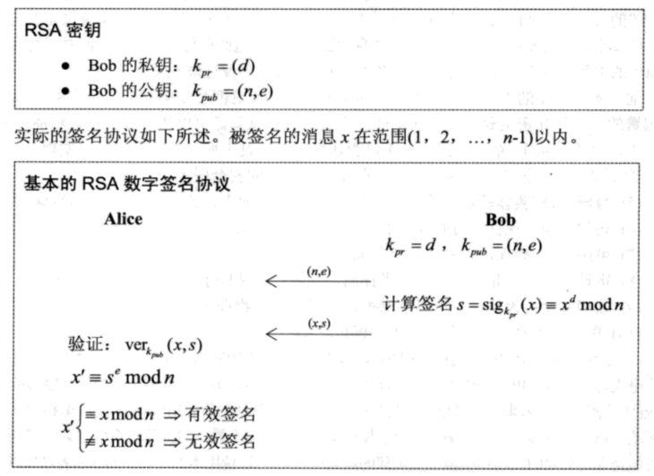

RSA dgst
========

参考 深入浅出密码学-常用加密技术原理与应用 中的 10.2.1 章节, 使用 openssl 验证下
RSA 的数字签名方法.



# 1. 使用 openssl 签名与验证

```console
$ echo abc > abc
$ openssl dgst -sha256 -sign ../key.pem -out sign.bin abc
$ openssl dgst -sha256 -verify ../pubkey.pem -signature sign.bin abc
Verified OK
```

查看数字签名 sign.bin , 是一个 256 字节的文件:

```console
$ hexdump -C sign.bin
00000000  73 df b7 8c 1b 51 ab 90  14 c0 d4 e7 f5 8b 82 e8  |s....Q..........|
00000010  30 07 de 0f f7 08 97 7e  90 b5 7a 98 f1 df 70 e8  |0......~..z...p.|
00000020  3e 71 9f 66 6a c3 f7 61  bb 1e 3b 2b 25 64 67 02  |>q.fj..a..;+%dg.|
00000030  d1 c9 cf 21 ec 42 50 d6  22 80 e9 c3 43 6d c4 9d  |...!.BP."...Cm..|
00000040  5d 03 74 54 2f f7 38 d7  5a d9 f0 01 c5 b4 e6 a6  |].tT/.8.Z.......|
00000050  d8 98 01 4f 1c 16 76 5b  fb ca ae 35 33 21 60 15  |...O..v[...53!`.|
00000060  ed a3 20 54 ba 8f 42 f6  11 2f 95 d7 7c 49 00 b7  |.. T..B../..|I..|
00000070  9e c9 53 f7 bf 12 cf b0  91 bf 37 5b 6e de 98 3d  |..S.......7[n..=|
00000080  42 10 8f 78 48 d5 0a 74  b3 30 6b c9 e6 3e af 93  |B..xH..t.0k..>..|
00000090  67 a7 11 c8 49 8a be b6  5c 4c 73 7c a1 58 0b ef  |g...I...\Ls|.X..|
000000a0  1a f9 d4 70 03 8b ed f3  8d 16 7f 3c 1a f2 2c bb  |...p.......<..,.|
000000b0  00 31 05 2b e9 40 d6 a1  f9 13 74 41 81 e9 31 e0  |.1.+.@....tA..1.|
000000c0  d4 3d 01 1c 25 90 2e 3b  5b cc 79 fe a7 4c cd de  |.=..%..;[.y..L..|
000000d0  27 2e 14 3f 24 da 36 7d  b4 bd 75 59 f3 f0 5c 91  |'..?$.6}..uY..\.|
000000e0  5f ce 14 a3 73 2c dd d3  19 9b 00 60 c6 87 84 31  |_...s,.....`...1|
000000f0  8e 5c 8f 40 7b b5 ea df  72 fd fd 05 4b f5 48 19  |.\.@{...r...K.H.|
00000100
```

我们来手动计算下签名. 从上节中已经提取到私钥 d, 公钥 n 和 e:

```
e=65537
d=0x6c2732ead65de251d013814534a6890ef108d29db624ae0ea6e8db472751c4ff2c42ee463046ab50de7fcb4b2df74ccb58fb0c369291fe2cccd34ab39546a5b962a3dfacbd198e9c8c75cc76d01385a93e613a48f53244ad39cb2017d71c1f3dbf5b4090e10464021b8c0ae4d63511635c841c4e460c683e313bcd7212bbfb7d67db964f6b9fb03cad7382d375c44a1329045174710d294926fd225080a5cf54b8515f311f85227b2e5002af6145909c6fa77d98a1fd6b310ad4227c39ac7a4da4330a92aac364526979f91603dee3d73054a8299640d500886da66fbf5067deea233b4f8c44c9d31f2b8a09e4f6129f433cbfdb6e3f5918014f01d8429cafb1
n=0x9C405A08D27AA25BA0BF571BFF0CEA806034EECBE06358D13198C5C9EAD7B3D7AB172B4624FDD04F9AB1ACAFD4F19E8DD3EA8FDBC9096C48A2C153E7A4A29D13DF521B6B3EC8BB9EB400B47A7106F7D3BBD1CBBE54B3DA751D209CC45120F9E616CB2641D265C173A5A0C3DA321708B0041AFADC6E8EB041C9934A3FC27FB8D1364F805B8949BD7E91C865153AC75448929D09F204B0D3912D15B86FEA13F65F6A7FB4CCD2B43E3126DED54C45E771F0CF57515E9C9FD4782963E010A97C26FAE842488BFC7331FCD5965901408ECE15C4CFB6D5B430D9BFABB03D3A27559C59BAA169C62B0D76F98CB7329DA9A284D9DB79B9E059F2693A2B9362D96778CBF3
```

## 1.1 尝试手动计算签名.

```console
$ sha256sum abc
edeaaff3f1774ad2888673770c6d64097e391bc362d7d6fb34982ddf0efd18cb  abc
$ x=0xedeaaff3f1774ad2888673770c6d64097e391bc362d7d6fb34982ddf0efd18cb
```

我们将这个数字套进上面的计算公式可以算出一个数字签名 `s = x ^ d mod n`:

```console
$ s=$(../../bn.out $x exp $d mod $n)
$ echo $s
0x6EB4EDFD2522E94BC5986E73CD0F12366FEEE23123CC69FA2E92FD93F0E4FC582E5D6B3382DE866DAB065846128E387FAE330E6F28CA618F475B6CC751C7D2945EB696FA99894E2A1C0B7FED628457A90171FD572591B81CC1808842120924DF13B095E418A7DDA
5EA77D9893F9B4542A461B1B8F6AA1ECD04692A479C1A54075CB61875D9D4CB90ED28CFE1592D341D64EB2E8A6E56F8079DAEF389601A9DBD65E3084D7509A01BBABBABB40BFC05517F876CA99B6632E6C14858E06B29A529C914CFABC96F41E04695F24782CD12E428
BA7D2ADCD3581183346658488CEFD244472318C12D28CE210F0556AB15E9A08DAFA3E8F022C96342C8D3CE0FC26F25
```

可以看到我们计算的结果跟 openssl 计算的签名并不相同. 先暂且不管为什么不相同. 先按照
签名的验证方法做下验证.

使用公钥和签名计算 `xx = s ^ e mod n`, 并与 `x mod n` 比对

```console
$ ../../bn.out $s exp $e mod $n
0xEDEAAFF3F1774AD2888673770C6D64097E391BC362D7D6FB34982DDF0EFD18CB
$ ../../bn.out $x mod $n
0xEDEAAFF3F1774AD2888673770C6D64097E391BC362D7D6FB34982DDF0EFD18CB
```

能看到这两个数字是相同的, 证明签名是正确的. 看到这里也能发现问题了, 我们生成的 RSA
秘钥的长度是 2048 位, 可以看到上面的 n 是一个很大的数字. 但是我们使用的 sha256
算法生成的哈希长度是 256 位, 使用这个数字去计算除 n 的模, 那肯定还是自身.

所以这个对文件计算哈希摘要的方式不够好.

## 1.2 逆向计算 openssl 的签名

提取签名信息:

```console
$ s=0x$(xxd -ps sign.bin | tr -d '\n')
```

计算原始的消息摘要:

```console
$ x=$(../../bn.out $s exp $e mod $n)
$ echo $x
0x01FFFFFFFFFFFFFFFFFFFFFFFFFFFFFFFFFFFFFFFFFFFFFFFFFFFFFFFFFFFFFFFFFFFFFFFFFFFFFFFFFFFFFFFFFFFFFFFFFFFFFFFFFFFFFFFFFFFFFFFFFFFFFFFFFFFFFFFFFFFFFFFFFFFFFFFFFFFFFFFFFFFFFFFFFFFFFFFFFFFFFFFFFFFFFFFFFFFFFFFFFFFFFFFFFFFFFFFFFFFFFFFFFFFFFFFFFFFFFFFFFFFFFFFFFFFFFFFFFFFFFFFFFFFFFFFFFFFFFFFFFFFFFFFFFFFFFFFFFFFFFFFFFFFFFFFFFFFFFFFFFFFFFFFFFFFFFFFFFFFFFFFFFFFFFFFFFFFFFFFFFFFFFFFFFFFFFFFFFFFFFFFFFFFFFFFFFFFFFFFFFFFF003031300D060960864801650304020105000420EDEAAFF3F1774AD2888673770C6D64097E391BC362D7D6FB34982DDF0EFD18CB
```

可以看到消息的最后就是我们计算的原始文件的 sha256 的哈希, 前面扩展了固定数字
003031300D060960864801650304020105000420 , 我们使用这个摘要计算下签名:

```console
$ ../../bn.out $x exp $d mod $n
0x73DFB78C1B51AB9014C0D4E7F58B82E83007DE0FF708977E90B57A98F1DF70E83E719F666AC3F761BB1E3B2B25646702D1C9CF21EC4250D62280E9C3436DC49D5D0374542FF738D75AD9F001C5B4E6A6D898014F1C16765BFBCAAE3533216015EDA32054BA8F42F6112F95D77C4900B79EC953F7BF12CFB091BF375B6EDE983D42108F7848D50A74B3306BC9E63EAF9367A711C8498ABEB65C4C737CA1580BEF1AF9D470038BEDF38D167F3C1AF22CBB0031052BE940D6A1F913744181E931E0D43D011C25902E3B5BCC79FEA74CCDDE272E143F24DA367DB4BD7559F3F05C915FCE14A3732CDDD3199B0060C68784318E5C8F407BB5EADF72FDFD054BF54819
```

这个数字与 openssl 计算出的结果相同.
