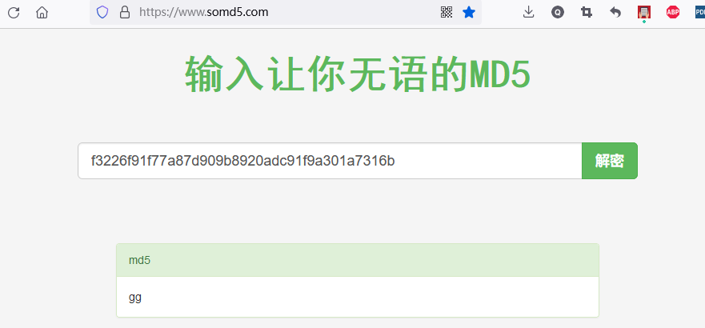
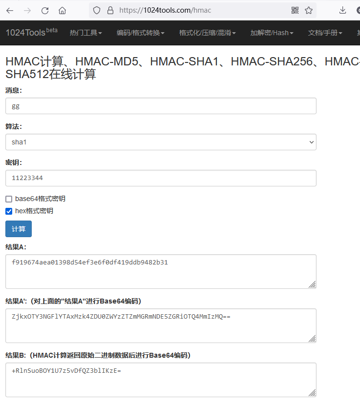

HMAC(Hash-Based Message Authentication Codes)
=============================================

# Hash

有很多算法能够数据计算摘要, 比如常见的 sha1 算法.

```console
$  echo -n gg | sha1sum
f3226f91f77a87d909b8920adc91f9a301a7316b  -
```

相同的数据经过相同的算法, 总是能够生成相同的摘要值, 并且无法通过摘要值反推原始数据. 这
项技术能够完美的应用于我们的密码存储上. 当用户设置密码的时候, 我们对密码按照一定算法
生成摘要值, 等用户登录的时候, 我们再次将用户输入的密码计算摘要值, 并且与数据库中预设
的数据进行比对, 可以确定密码是否正确. 这样即使数据库中的预设摘要值泄漏, 也无法还原出
我们的密码.

# 彩虹表

但是事实真是如此吗?

随着如今计算机性能的飞速发展, 我们可以提前生成一些密码, 并计算和存储其Hash数值, 拿到
一个泄漏的摘要值之后, 去我们的数据库中查找一个与之相匹配的密码.

例如输入我们上面产生的 "gg" 的哈希值, 可以在 https://www.somd5.com/ 网站上找到想匹配
的原始密码.



# 盐

为了解决彩虹表破解的难题, linux系统存储密码的时候, 使用了盐来处理. 简单的说, 盐就是
在设置密码的时候随机生成的字符, 通过一定的组合关系掺入到原始密码中, 并将掺杂之后的数据
生成摘要. 存储的时候将生成的摘要和盐值一同存储.

因盐的数值是随机的, 所以这也会将提前计算的彩虹表失效.

例如 '/etc/shadow' 中存储的密码条目:

```
sysadm:$5$SetxE1Np3rSAWtay$9rLMIsigbwx6JjI.Hek9S6AM8eDN1CC0AiglhiC5zD/:19005:0:99999:7:::
```

# HMAC

HMAC(散列消息认证码)是一种基于摘要算法, 生成消息认证码的方法. 它不限定使用的Hash算法,
比如常见的 sha1, sha256 等都可以作为其摘要算法.

它做摘要的时候依赖一个秘钥, 这个秘钥的功能跟上面提到的盐相同.

使用 openssl 做了一个测试代码:

```console
$ sh hmacsha1.c
$ ./hmacsha1.out 11223344 gg
f919674aea01398d54ef3e6f0df419ddb9482b31
```

使用秘钥 0x11, 0x22, 0x33, 0x44 对消息 "gg" 生成一个 MAC, 算法是基于 sha1, 生成的
结果与 https://1024tools.com/hmac 在线工具一致.


