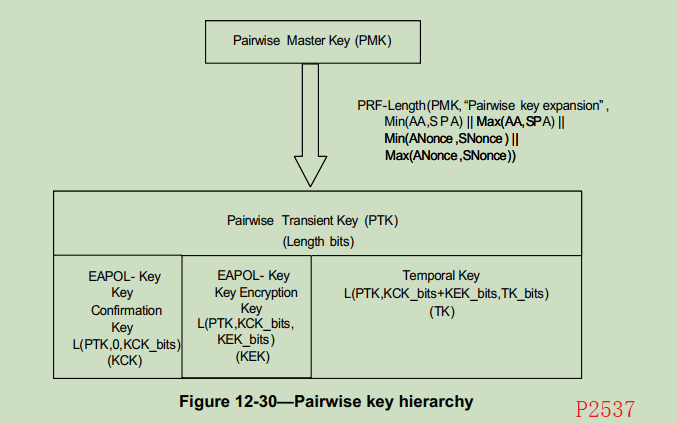

秘钥
====

WISUN 协议中使用了许多种秘钥, 下面来看下秘钥的生成过程.

参考文档: <80211-2020.pdf>

# PTK(Pairwise Transient key)

成对临时秘钥(PTK)是通过PMK秘钥经过[PRF](../ieee80211i_prf/README.md)算法生成的.
流程图如下:



生成的PTK被拆分成三部分使用, 分别是 KCK, KEK 和 TK. WISUN 标准中 PTK 是通过
PRF-384 生成的 384bit 的伪随机数, 所以 TK 是 CCMP: L(PTK, 256, 128).

在 [20231128](../wireshark/20231128/README.md) 中记录了一个 PTK 秘钥, 按照这个
格式拆开之后的秘钥如下:

| 类型 | 数值                                            |
| ---- | ----------------------------------------------- |
| KCK  | c7:be:60:74:90:bb:07:16:3a:d8:52:d2:63:cf:c6:6b |
| KEK  | 03:49:14:41:94:68:16:55:ec:5a:b1:d8:f8:45:11:09 |
| TK   | 7e:86:1e:f6:48:e1:64:46:d1:68:92:f1:bb:a2:90:c5 |

# GTK/GAK

GTK: Group Transient Key KDE

GAK: Group AES Key

GTK 是组临时秘钥, 共有四组. GAK 是通过一个计算公式从 GTK 转换来的. 既然是转换的, 那
自然也有四组. 拷贝一组 GTK/GAK 秘钥, 来验证下转换公式.

```
Gtks   [0] 461d435d6fa20994287b108632fcf6ff
       [1] 00000000000000000000000000000000
       [2] 00000000000000000000000000000000
       [3] 00000000000000000000000000000000

Gaks   [0] 242f63dc22a07b4c0af4563c637a2750
       [1] 261bacfe97e52ef13ae5d9af38c20ff3
       [2] 261bacfe97e52ef13ae5d9af38c20ff3
       [3] 261bacfe97e52ef13ae5d9af38c20ff3
```

GAK 的计算公式在 wisun 协议中的 6.5.4.1.2 Pairwise AES Key(PAK) 中定义:

        GAK = Truncate-128(SHA-256(Network Name || GTK[x])), where:
        x is the value 0, 1, 2, 3.

Network Name 是 wisun 网络通过 PA 广播出来的网络名, 在 wireshark 中可以看到内容是
`Wi-SUN Network`, 使用 [hash](../hmac/hash.c) 工具根据这个公式计算:

```console
$  ./hash.out --sha256 'Wi-SUN Network' 0x461d435d6fa20994287b108632fcf6ff
242f63dc22a07b4c0af4563c637a27503b78a9d459c8cb1afd4b4232fcc415bf
$  ./hash.out --sha256 'Wi-SUN Network' 0x00000000000000000000000000000000
261bacfe97e52ef13ae5d9af38c20ff38ea20e2c69aefcf89d6090f326b24e8c
```

将 SHA-256 的哈希数值截短到 128bit 之后能够与 wsbrd 中的 GAK 匹配.
