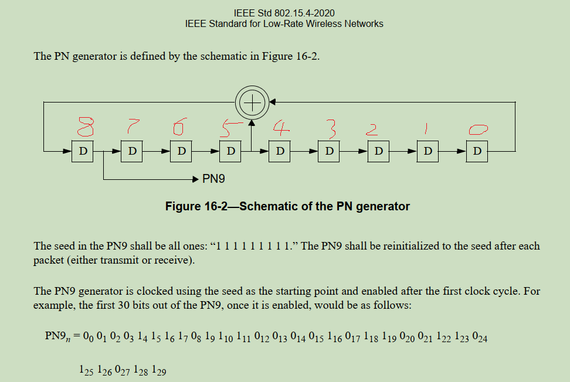
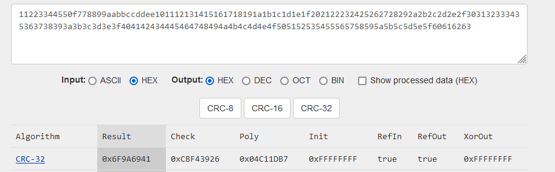

PN9: 9bit Pseudo-random Number
==============================

# 802.15.4 定义的算法

PN9 是一个生成 9bit 伪随机数的算法, 算法内部有几种不同的实现, 一种算法可以参考:
[TI的文档](https://www.ti.com/lit/an/swra322/swra322.pdf).

WISUN 协议遵循 802.15.4 规范, 在 802.15.4 规范中定义了另一种 PN9 的算法, 电路
实现如下:



上图共有 9 个移位寄存器, bit8 寄存器的数值作为 PN9 的结果输出, 并且每一次移位之后将
bit5 和 bit0 的数值异或, 结果填入 bit8 中. 所有寄存器的初始数值都是 1, 规范中也给出
了一个前 30bit 的结果作为参考.

根据电路的搭建, 做一个 C 语言的程序来模拟计算:

```c
#include <stdio.h>
#include <stdint.h>

static uint16_t pn9_shift1(uint16_t pn9)
{
	unsigned int bit0 = (pn9 >> 0) & 1, bit5 = (pn9 >> 5) & 1;
	unsigned int xor;

	pn9 = pn9 >> 1;
	xor = bit0 ^ bit5;
	pn9 |= (xor << 8);

	printf("%d ", xor);
	return pn9;
}

int main(int argc, char **argv)
{
	uint16_t pn9 = 0x1ff;

	for (int i = 0; i < 30; i++)
		pn9 = pn9_shift1(pn9);

	printf("\n");
	return 0;
}
```

编译并运行之后, 可以看到计算的结果与示例一致:

```console
$ gcc 1.c -o 1.out
$ 1.out
0 0 0 0 1 1 1 1 0 1 1 1 0 0 0 0 1 0 1 1 0 0 1 1 0 1 1 0 1 1
```

# PN9 表格

修改一个程序, 按照字节计算 PN9 表格:

```c
#include <stdio.h>
#include <stdint.h>

static void hexdump(const uint8_t *buf, size_t sz, unsigned int addr)
{
	for (size_t i = 0; i < sz; i++) {
		if ((i % 16) == 0)
			printf("%04lu: ", addr + i);

		printf("%02x ", buf[i]);

		switch (i % 16) {
		case 15:
			putchar('\n');
			break;
		case 7:
			putchar(' ');
			break;
		}
	}
}

static uint16_t pn9_shift1(uint16_t pn9, unsigned int *xor_out)
{
	unsigned int bit0 = (pn9 >> 0) & 1, bit5 = (pn9 >> 5) & 1;
	unsigned int xor;

	pn9 = pn9 >> 1;
	xor = bit0 ^ bit5;
	pn9 |= (xor << 8);

	if (xor_out)
		*xor_out = xor;

	return pn9;
}

int main(int argc, char **argv)
{
	uint8_t pn9_tables[2048] = { 0 };
	uint16_t pn9 = 0x1ff;

	for (size_t i = 0; i < sizeof(pn9_tables); i++) {
		unsigned int xor_out;
		uint8_t n = 0;

		for (size_t bit = 0; bit < 8; bit++) {
			pn9 = pn9_shift1(pn9, &xor_out);
			n |= (xor_out << bit);
		}

		pn9_tables[i] = n;
	}

	hexdump(pn9_tables, sizeof(pn9_tables), 0);
	return 0;
}
```

运行之后, 可以看到在第 511 个字节之后出现了重复:

```
0000: f0 0e cd f6 c2 19 12 75  3d e9 1c b8 cb 2b 05 aa
0016: be 16 ec b6 06 dd c7 b3  ac 63 d1 5f 1a 65 0c 98
0032: a9 c9 6f 49 f6 d3 0a 45  6e 7a c3 2a 27 8c 10 20
0048: 62 e2 6a e3 48 c5 e6 f3  68 a7 04 99 8b ef c1 7f
0064: 78 87 66 7b e1 0c 89 ba  9e 74 0e dc e5 95 02 55
0080: 5f 0b 76 5b 83 ee e3 59  d6 b1 e8 2f 8d 32 06 cc
0096: d4 e4 b7 24 fb 69 85 22  37 bd 61 95 13 46 08 10
0112: 31 71 b5 71 a4 62 f3 79  b4 53 82 cc c5 f7 e0 3f
0128: bc 43 b3 bd 70 86 44 5d  4f 3a 07 ee f2 4a 81 aa
0144: af 05 bb ad 41 f7 f1 2c  eb 58 f4 97 46 19 03 66
0160: 6a f2 5b 92 fd b4 42 91  9b de b0 ca 09 23 04 88
0176: 98 b8 da 38 52 b1 f9 3c  da 29 41 e6 e2 7b f0 1f
0192: de a1 d9 5e 38 43 a2 ae  27 9d 03 77 79 a5 40 d5
0208: d7 82 dd d6 a0 fb 78 96  75 2c fa 4b a3 8c 01 33
0224: 35 f9 2d c9 7e 5a a1 c8  4d 6f 58 e5 84 11 02 44
0240: 4c 5c 6d 1c a9 d8 7c 1e  ed 94 20 73 f1 3d f8 0f
0256: ef d0 6c 2f 9c 21 51 d7  93 ce 81 bb bc 52 a0 ea
0272: 6b c1 6e 6b d0 7d 3c cb  3a 16 fd a5 51 c6 80 99
0288: 9a fc 96 64 3f ad 50 e4  a6 37 ac 72 c2 08 01 22
0304: 26 ae 36 8e 54 6c 3e 8f  76 4a 90 b9 f8 1e fc 87
0320: 77 68 b6 17 ce 90 a8 eb  49 e7 c0 5d 5e 29 50 f5
0336: b5 60 b7 35 e8 3e 9e 65  1d 8b fe d2 28 63 c0 4c
0352: 4d 7e 4b b2 9f 56 28 72  d3 1b 56 39 61 84 00 11
0368: 13 57 1b 47 2a 36 9f 47  3b 25 c8 5c 7c 0f fe c3
0384: 3b 34 db 0b 67 48 d4 f5  a4 73 e0 2e af 14 a8 fa
0400: 5a b0 db 1a 74 1f cf b2  8e 45 7f 69 94 31 60 a6
0416: 26 bf 25 d9 4f 2b 14 b9  e9 0d ab 9c 30 42 80 88
0432: 89 ab 8d 23 15 9b cf a3  9d 12 64 2e be 07 ff e1
0448: 1d 9a ed 85 33 24 ea 7a  d2 39 70 97 57 0a 54 7d
0464: 2d d8 6d 0d ba 8f 67 59  c7 a2 bf 34 ca 18 30 53
0480: 93 df 92 ec a7 15 8a dc  f4 86 55 4e 18 21 40 c4
0496: c4 d5 c6 91 8a cd e7 d1  4e 09 32 17 df 83 ff f0
0512: 0e cd f6 c2 19 12 75 3d  e9 1c b8 cb 2b 05 aa be
```

# PN9 二进制数据白化及逆白化

PN9 算法是使用异或的方式白化的, 按照同样的异或算法可以对白化数据逆处理. 参考代码:

```c
#include <stdio.h>
#include <stdint.h>
#include <getopt.h>

static void hexdump(const uint8_t *buf, size_t sz, unsigned int addr)
{
	for (size_t i = 0; i < sz; i++) {
		if ((i % 16) == 0)
			printf("%04lu: ", addr + i);

		printf("%02x ", buf[i]);

		switch (i % 16) {
		case 15:
			putchar('\n');
			break;
		case 7:
			putchar(' ');
			break;
		}
	}

	if ((sz % 16) != 0)
		putchar('\n');
}

static uint8_t pn9_tables[511] = { 0 };

static uint16_t pn9_shift1(uint16_t pn9, unsigned int *xor_out)
{
	unsigned int bit0 = (pn9 >> 0) & 1, bit5 = (pn9 >> 5) & 1;
	unsigned int xor;

	pn9 = pn9 >> 1;
	xor = bit0 ^ bit5;
	pn9 |= (xor << 8);

	if (xor_out)
		*xor_out = xor;

	return pn9;
}

static void pn9_table_init(void)
{
	uint16_t pn9 = 0x1ff;

	for (size_t i = 0; i < sizeof(pn9_tables); i++) {
		unsigned int xor_out;
		uint8_t n = 0;

		for (size_t bit = 0; bit < 8; bit++) {
			pn9 = pn9_shift1(pn9, &xor_out);
			n |= (xor_out << bit);
		}

		pn9_tables[i] = n;
	}
}

static size_t str01_to_buffer(const char *s, const char **endp, uint8_t *buf,
			      size_t bufsz, int lsb_first)
{
	size_t bytes = 0, binary_counts = 0;

	for (; *s != '\0' && bytes < bufsz; s++) {
		uint8_t bit = binary_counts % 8;
		int n = *s - '0';

		if (n != 0 && n != 1)
			break;

		if (lsb_first) {
			buf[bytes] |= (n << bit);
		} else {
			buf[bytes] <<= 1;
			buf[bytes] |= n;
		}

		binary_counts++;
		if ((binary_counts % 8) == 0) {
			bytes++;
			if (bytes < bufsz)
				buf[bytes] = 0;
		}
	}

	if (endp)
		*endp = s;

	return binary_counts;
}

static struct option long_options[] = {
	/* name		has_arg,		*flag,		val */
	{ "lsb",	no_argument,		NULL,		'L' },
	{ "msb",	no_argument,		NULL,		'M' },
	{ NULL,		0,			NULL,		0   },
};

int main(int argc, char **argv)
{
	uint8_t buf[4096] = { 0 };
	size_t binary_size;
	const char *endp;
	int lsb_first = 1;

	while (1) {
		int option_index = 0;
		int c;

		c = getopt_long(argc, argv, "", long_options, &option_index);
		if (c == -1)
			break;

		switch (c) {
		case 'L':
			lsb_first = 1;
			break;
		case 'M':
			lsb_first = 0;
			break;
		}
	}

	if (!(optind < argc)) {
		fprintf(stderr, "Usage: pn9 [--lsb|msb] \"binary-strings\"\n");
		fprintf(stderr, "    --lsb: lsb first, 00000001 means 0x80\n");
		fprintf(stderr, "    --msb: msb first, 00000001 means 0x01\n");
		return -1;
	}

	pn9_table_init();

	binary_size = str01_to_buffer(argv[optind], &endp, buf, sizeof(buf),
				      lsb_first);
	if (*endp != '\0') {
		fprintf(stderr, "input binary string is bad after:\n");
		fprintf(stderr, "%s\n", endp);
		return -1;
	} else if (binary_size % 8) {
		fprintf(stderr, "binary size(%zu) is not multi of 8\n",
			binary_size);
		return -1;
	}

	printf("Input hex strings:\n");
	hexdump(buf, binary_size / 8, 0);

	printf("PN9 hex strings\n");
	for (size_t i = 0; i < binary_size / 8; i++)
		buf[i] ^= pn9_tables[i % sizeof(pn9_tables)];
	hexdump(buf, binary_size / 8, 0);

	return 0;
}
```

编译代码之后可以使用一个白化的数据进行测试:

```console
$ pn9 '100001110011010001111111010011011110100101101000101001101011111100100101110000101110010100101110011010001010001110101000110111010011010110100000000111111100010100001000010100111111101101010101011011010001111010110011010000100010000001011110001101001001110111010001010101111101001000110110000010110010111101000100001101100010001010001010111101111110000010010000110001010000010010001000000010101000101101111010011010110111111001001111011110110101001101001010001110010001110000100101101011010000101110000001011111000101110000100011010001000111110011100101110100101000001111001111001010111111110001000010100010011101010101011011010010100010000010110000000110100100010001110000101010111001110111011101000000000011000101010111001011010100111011001011101101100110011010110101011011011110000101101111101100101000011001100000'
Input hex strings:
0000: e1 2c fe b2 97 16 65 fd  a4 43 a7 74 16 c5 15 bb
0016: ac 05 f8 a3 10 ca df aa  b6 78 cd 42 04 7a 2c b9
0032: 8b ea 4b 6c d0 f4 22 6c  44 51 ef 07 09 a3 20 11
0048: 50 d1 5e d6 7e f2 de ca  52 9c 38 a4 b5 d0 81 3e
0064: 3a c4 22 3e a7 4b c1 f3  d4 3f 42 91 ab da 52 04
0080: 0d 58 22 0e d5 b9 bb 00  8c ea b4 72 d3 6d 66 ad
0096: b6 87 f6 4d 61 06
PN9 hex strings
0000: 11 22 33 44 55 0f 77 88  99 aa bb cc dd ee 10 11
0016: 12 13 14 15 16 17 18 19  1a 1b 1c 1d 1e 1f 20 21
0032: 22 23 24 25 26 27 28 29  2a 2b 2c 2d 2e 2f 30 31
0048: 32 33 34 35 36 37 38 39  3a 3b 3c 3d 3e 3f 40 41
0064: 42 43 44 45 46 47 48 49  4a 4b 4c 4d 4e 4f 50 51
0080: 52 53 54 55 56 57 58 59  5a 5b 5c 5d 5e 5f 60 61
0096: 62 63 41 69 9a 6f
```

其中的二进制10字符串是从 [RAILtest](./silicon_labs_railtest.md) 实验室, 从 URH 的
解码数据中提取出来的. 经过 PN9 逆白化处理之后, 可以看到还原数据.

根据 802.15.4 的定义, RAILtest 一节中设置的 fcstype 为 4 字节 CRC32, 所以数据的最后
四字节是发送时自动填充的 CRC, 可以对数据做一下校验:
[crccalc](https://crccalc.com/?crc=11223344550f778899aabbccddee101112131415161718191a1b1c1d1e1f202122232425262728292a2b2c2d2e2f303132333435363738393a3b3c3d3e3f404142434445464748494a4b4c4d4e4f505152535455565758595a5b5c5d5e5f60616263&method=crc32&datatype=hex&outtype=0)


