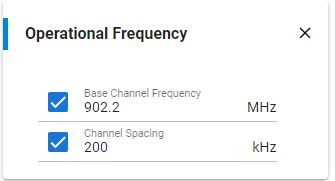

Silicon Labs RAILtest
=====================

Silicon Labs 提供一个测试工程, 可以用于测试芯片射频相关的东西. 可以参考官方文档:
[wisun-phy-quick-start](https://docs.silabs.com/wisun/1.4/wisun-phy-quick-start/03-wi-sun-configuration-with-railtest-for-efr32fg25)
下面按照这个示例, 做一个简单的测试.

需要准备两块板子, 一块发送, 一块接收. 选择 Simplicity Studio 中的
'RAIL - SoC RAILtest' 示例, 并创建一个工程. 创建完毕之后, 会首先弹出 "Radio Configurator"
对话框, 按照官方的文档, 选择 "WI-SUN FAN 1.0 Profile" 和 "NA(北美)", 其他的保持默认.


如果点击 Customzied 按钮, 能够看到频率划分:



按照 902.20MHz 到 927.80MHz, 每隔 200KHz 划分一个通道, 共计 129 个通道. 按照这种
计算方式, 915MHz 为 64 通道.

之后编译工程并下载程序, 可以通过芯片的 PA8, PA9 串口进行通讯, 波特率是 115200.

输入 "help" 命令可以查看完整的命令列表和参数:

```console
> help
_________________________________
____Application_Configuration____
setEventConfig      Control RAIL events.
                    [uint32] eventsMask<31:0>
                    [uint32] eventsValues<31:0>
                    [uint32opt] eventsMask<63:32>
                    [uint32opt] eventsValues<63:32>
resetCounters       Resets the TX and RX counters.
setPeripheralEnable Control LEDs and LCD peripherals.
                    [uint8] [0=Disable] 1=Enable
setNotifications    Control asynchronous status prints (rxPacket,txEnd,txError).
                    [uint8] 0=Disable [1=Enable]
getLogLevels        Show whether notifications or peripherals are enabled.
getVersion          Get version information.
getVersionVerbose   Get verbose version information.
setPtiProtocol      Set PTI protocol for Network Analyzer.
                    [uint8] 0=Custom 2=Thread 3=BLE 4=Connect 5=Zigbee 6=Z-Wave
getPti              Get PTI configuration.
setPrintingEnable   Control all printing in RAILtest, except CLI.
                    [uint8] 0=Disable [1=Enable]
____________________________
____Receive_and_Transmit____
rx                  Control receive mode.
                    [uint8] 0=Disable [1=Enable]
rxAt                Configure scheduled receive.
                    [uint32] startTimeUs
                    [string] 'rel'=Relative 'abs'=Absolute
                    [uint32] endTimeUs
                    [string] 'rel'=Relative 'abs'=Absolute
                    [uint8opt] rxTransEndSched: [0]/1
                    [uint8opt] hardEnd: [0]/1
setRxOptions        Show/Configure receive options (RAIL_RX_OPTIONs).
                    [uint32opt] rxOptionsValues: bitmask of enabled options
tx                  Transmit packets with current TX options.
                    [uint32] number of packets, 0=continuous until next 'tx 0'
txWithOptions       Same tx command. This command is deprecated.
                    [uint32] number of packets, 0=continuous until next 'tx 0'
txAfterRx           Schedule a TX with specified delay after each RX.
                    [uint32] delayUs: 0=Disable
configTxOptions     Show/Configure transmit options (RAIL_TX_OPTIONs).
                    [uint32opt] txOptionsValues: bitmask of enabled options
setFixedLength      Configure fixed length packet operation.
                    [uint16] fixedLength: payload bytes
setPower            Set the transmit power. The radio must be IDLE.
                    [int32] power: deci-dBm unless 'raw' is added
                    [stringopt] 'raw'=units are raw power level
getPower            Get the transmit power in deci-dBm.
setPowerConfig      Set transmit PA configuration. Must use setpower afterwards.
                    [string] paMode
                    [uint16] millivolts
                    [uint16] rampTimeUs
getPowerConfig      Get the transmit PA configuration.
getPowerLimits      Get min and max powerLevel for a power mode.
                    [uint8opt] powerMode
enablePaAutoMode    Control automatic PA selection based on the TX power level.
                    [uint8] 0=Disable 1=Enable
configPaAutoMode    Configure entries in the default PA Auto Mode plugin.
                    [uint8] start Index
                    [int32opt] min max mode band: PA auto config entries
sweepTxPower        Sweep TX power for the current PA by toning at each level.
offsetLqi           Adjust the hardware's LQI value for received packets.
                    [int32] offset: signed value to add
                    The resulting LQI is capped within 0..255 range.
getRssi             Get RSSI in dBm. It'll be invalid if receiver isn't ready.
                    [uint32opt] [0=don't wait] 1=wait for valid RSSI if possible
sweepPower          Sweep power by toning low/high in a square wave fashion.
                    [int32] lowPower: deci-dBm
                    [int32] hiPower: deci-dBm
                    [uint32] periodUs
startAvgRssi        Start AGC RSSI averaging.
                    [uint32] averageTimeUs
                    [uint16opt] channel: if different than current channel
getAvgRssi          Get AGC RSSI averaging result.
setTxTone           Control tone transmission.
                    [uint32] 0=Disable 1=Enable
                    [uint32opt] antenna: [0]/1
                    [uint32opt] mode: [0]/1=phaseNoise
setTxStream         Control stream transmission.
                    [uint32] 0=Disable 1=Enable
                    [uint32opt] streamMode: [1=PN9] 2=1010 3=phaseNoise 0=tone
                    [uint32opt] antenna: [0]/1
status              Print the current status counters.
fifoStatus          Print the current FIFO-related counters.
setTxHoldOff        Control transmit hold-off (blocking of transmits).
                    [uint32] 0=Disable 1=Enable
setTxDelay          Set the inter-packet delay for repeated TX.
                    [uint32] delayMilliseconds
getTxDelay          Get the inter-packet millisecond delay for repeated TX.
setTxPayload        Set TX packet payload bytes for future transmits.
                    [uint16] offset
                    [uint8opt] byte0 byte1 ...
setTxRandom         Set a specified range of bytes in the Tx packet payload to a
                    random value. Call setTxRandom again to stop randomizing the payload.
                    [uint16opt] Start Index
                    [uint16opt] End Index
setTxPayloadQuiet   Like setTxPayload, but less verbose.
                    [uint16] offset
                    [uint8opt] byte0 byte1 ...
setTxLength         Set how much data to load into the TX FIFO for transmitting.
                    Actual packet length may vary based on radio configuration.
                    [uint16] lengthBytes
printTxPacket       Print the current TX payload data and byte length.
peek                Peek at the start of the receive buffer.
                    [uint16] bytes: 1-10
                    [uint16opt] offset: [0]
getTime             Get the current RAIL time in microseconds.
setTime             Set the current RAIL time.
                    [uint32] timeUs
dataConfig          Control the data methods for TX and RX.
                    [string] txMethod: 'pkt'/'fifo'
                    [string] rxMethod: 'pkt'/'fifo'
                    [uint8opt] RAIL_RxDataSource_t (>0 needs fifo mode)
                    [uint8opt] RAIL_TxDataSource_t (>0 needs ping-pong buffer)
setRxFifo           Set the receive buffer length.
                    [uint16] lengthBytes: range 64-RX_BUFFER_SIZE
setTxFifoThreshold  Set the TX FIFO Almost Empty threshold.
                    [uint16] thresholdBytes: below which the event triggers
setRxFifoThreshold  Set the RX FIFO Almost Full threshold.
                    [uint16] thresholdBytes: above which the event triggers
fifoModeTestOptions Manual control over RAILtest FIFO actions.
                    [uint8] txFifo: 1=Manual 0=Automatic
                    [uint8] rxFifo: 1=Manual 0=Automatic
rxFifoManualRead    Read and print bytes from receive FIFO when in manual mode.
                    [uint8] appendedInfo: 1=include packet metadata
                    [uint16] bytesToRead
                    [uint8opt] [0=don't] 1=show timestamps with appendedInfo
txFifoManualLoad    Try to load data into available TX FIFO space.
fifoReset           Reset the transmit and/or receive FIFO.
                    [uint8] tx: 1=reset TX FIFO
                    [uint8] rx: 1=reset RX FIFO
abortRxPacket       Idle the radio shortly after RX sync word detection.
                    [uint32] abortOffsetUs
printTxAcks         Control printing of TX ACK packets.
                    [uint8] [0=Disable] 1=Enable
configRxHopping     Configure an RX Channel Hopping sequence.
                    [uint32opt] channel hopMode param delayUs: a hop's config,
                                repeat for additional hops ...
                    Use no arguments to get Z-Wave radio config defaults.
enableRxHopping     Control RX channel hopping previously configured.
                    [uint8] [0=Disable] 1=Enable
                    [uint8opt] [0=Continue] 1=Restart sequence
configRxHoppingOpts Configure options for a hop. Use configRxHopping after.
                    [uint8] hopIndex
                    [uint8] options
                    [int8opt] rssiThreshold: dBm for the threshold option
configRxMultiHop    Configure multi-sense for a hop. Use configRxHopping after.
                    [uint8] hopIndex
                    [uint32] syncDetectUs
                    [uint32] preambleSenseUs
                    [uint32] timingSenseUs
                    [uint32] timingReSenseUs
getRxHoppingRssi    Get the latest RSSI for a hopping channel.
                    [uint8] hopIndex
spectrumAnalyzer    Hop across a channel range to see the RSSI distribution.
                    [uint8] 1=Show ASCII-Art graph (non-parseable output)
                    [uint16opt] minChannel: [0]-65535
                    [uint16opt] maxChannel: 0-[65535]
                    Channel range is limited by the PHY and by hopping's
                    MAX_NUMBER_CHANNELS.
configRxDutyCycle   Configure RX Duty Cycling of the receiver.
                    [uint32] hopMode
                    [int32] parameter(s) {syncUs preamUs timingUs retimingUs}
                    [int32] delayUs
                    [int32opt] options
                    [int32opt] rssiThreshold: dBm for the threshold option
enableRxDutyCycle   Control RX duty cycling previously configured.
                    [uint8] DutyCycling: 0=Disable 1=Enable
                    [uint8opt] ScheduledWakeup: [0=Disable] 1=Enable
getDefaultRxDutyCycleConfig Get the default RX duty cycle configuration.
setTxAltPreambleLen Set alternate TX preamble length, enabled via txOptions.
                    [uint16] preambleBits
configSyncWords     Set sync words and their length. The radio must be off.
                    [uint8] bits: 2-32
                    [uint32] syncWord1
                    [uint32opt] syncWord2: [same as syncWord1]
getSyncWords        Get the sync word length in bits and value(s).
printRxErrors       Control printing of RX error packets.
                    [uint8] [0=Disable] 1=Enable
printRxFreqOffsets  Control printing of RX frequency offsets.
                    [uint8] [0=Disable] 1=Enable
printDataRates      Print the data rates of the current PHY.
stopInfinitePream   Stops an infinite preamble transmission.
___________________________________
____Energy_Modes_and_RF_Sensing____
sleep               Sleep until UART input or RF Sensed (if either configured).
                    [string] energyMode: 0-4[hs], for EM1P use 2 with radio on
                    [uint32opt] Legacy: RfSenseUs
                                        RfBand: 0=none,1=GHz,2=MHz,3=both
                          or Selective: SyncwordBytes Syncword RfBand
rfsense             Start RfSensing.
                    [uint32] Legacy: RfSenseUs; Selective: SyncwordBytes
                    [uint32opt] Legacy: RfBand: 0=none,1=GHz,2=MHz,3=both
                          or Selective: Syncword RfBand: as above
configRfSenseWakeup Configure RFSense Selective Wakeup PHY for transmitting.
setRfSenseTxPayload Load TX FIFO with RfSense Selective(OOK) Mode wake packet.
                    [uint8] syncwordNumBytes: 1-4
                    [uint32] syncWord: sent from least to most significant byte
_________________________
____Address_Filtering____
configAddressFilter Configure the addresss filter.
                    [uint32] matchTable
                    [uint8opt] offset0 size0 offset1 size1 ...
                    Enter more offsets and sizes if required.
setAddressFiltering Control address filtering.
                    [uint8] 0=Disable 1=Enable
getAddressFiltering Get the current state of address filtering.
printAddresses      Print the current address filtering addresses.
setAddress          Set a specific filtering address value.
                    [uint8] field: 0-1
                    [uint8] filterIndex: 0-3
                    [uint8opt] addrByte0 addrByte1 ... addrByte7
setAddressMask      Set a specific filtering address mask.
                    [uint8] field: 0-1
                    [uint8opt] bitMask
setAddressEnable    Control address filtering for a specific address.
                    [uint8] field: 0-1
                    [uint8] filterIndex: 0-3
                    [uint8] 0=Disable 1=Enable
__________________________
____Error_Rate_Testing____
perRx               Start a Packet Error Rate test. 'perRx 0 0' stops test.
                    [uint32] number of packets
                    [uint32] delayUs
perStatus           Get the PER test results. Also see status command.
setBerConfig        Set number of bytes to receive in BER mode.
                    [uint32] number of bytes: 0=maximum (536870911)
berRx               Control BER receive mode.
                    [uint8] 0=Disable 1=Enable
berStatus           Get status of current or last BER test.
                    Status is reset by setBerConfig and berRx enable.
______________________________
____Listen_Before_Talk_LBT____
setLbtMode          Show/Set the LBT mode for transmits.
                    [stringopt] 'off'/'csma'/'lbt'
getLbtParams        Get the current LBT parameters.
setLbtParams        Set LBT parameters.
                    [uint8] minBo
                    [uint8] maxBo
                    [uint8] tries
                    [int32] ccaThreshold
                    [uint16] backoffUs
                    [uint16] durationUs
                    [uint32] timeoutUs
set802154CcaMode    Set 802.15.4 CCA Mode
                    [uint8] ccaMode 0=RSSI 1=Signal 2=RSSI|Signal 3=RSSI&Signal 4=Always transmit
_____________________
____802_15_4_Mode____
enable802154        Configure and enable 802.15.4 mode.
                    [string] defaultState: 'idle'/'rx'
                    [uint16] idleToRxUs
                    [uint16] turnaroundTimeUs
                    [int16] ackTimeoutUs: to ACK's sync-detect
                    [uint8opt] defaultFP: [0]/1 Frame Pending for poll ACKs
config2p4GHz802154  Configure the radio for 2.4 GHz 802.15.4.
                    Use with enable802154.
                    [uint8opt] antDiv: [0=Disable] 1=Enable
                    [uint8opt] coex: [0=Disable] 1=Enable
                    [uint8opt] fem: [0=Disable] 1=Enable
                    [uint8opt] custom: [0=None] 1=Custom1
                    [uint8opt] 2mbps: [0=Disable] 1=Enable
config863MHz802154  Configure the radio for 863 MHz 802.15.4 GB868.
                    Use with enable802154.
config915MHz802154  Configure the radio for 915 MHz 802.15.4 GB868.
                    Use with enable802154.
set802154e          Configure 802.15.4E options.
                    [uint32] RAIL_IEEE802154_EOptions_t
set802154g          Configure 802.15.4G options.
                    [uint32] RAIL_IEEE802154_GOptions_t
set802154FpMode     Control early and data frame pending lookup.
                    [uint8] early:     [0=Disable] 1=Enable
                    [uint8] dataframes:[0=Disable] 1=Enable
acceptFrames        Control 802.15.4 frame type acceptance.
                    [uint8] command: 0=Reject [1=Accept]
                    [uint8] ack:    [0=Reject] 1=Accept
                    [uint8] data:    0=Reject [1=Accept]
                    [uint8] beacon:  0=Reject [1=Accept]
                    [uint8opt] multipurpose: [0=Reject] 1=Accept
setPromiscuousMode  Control promiscuous mode.
                    [uint8] 0=Disable 1=Enable
setRxToEnhAckTx     Set an RxToTx turnaround time used just for Enh-ACKs.
                    [int32] rxToTxUs (0=same as Imm-ACKs, -1=don't change)
setPanCoordinator   Control whether node is a PAN coordinator.
                    [uint8] 1=Yes 0=No
setPanId802154      Set the PAN ID for a filtering index.
                    [uint16] panId
                    [uint8opt] filterIndex: [0]-2
setShortAddr802154  Set the short address for a filtering index.
                    [uint16] shortAddr
                    [uint8opt] filterIndex: [0]-2
setLongAddr802154   Set the long address for a filtering index.
                    [uint8] longAddr_0
                    [uint8] longAddr_1
                    [uint8] longAddr_2
                    [uint8] longAddr_3
                    [uint8] longAddr_4
                    [uint8] longAddr_5
                    [uint8] longAddr_6
                    [uint8] longAddr_7
                    [uint8opt] filterIndex: [0]-2
setAddresses802154  Set all 802.15.4 address information.
                    [uint16] panId0
                    [uint16] shortAddr0
                    [stringopt] longAddr0
                    [stringopt] panId1 shortAddr1 longAddr1 ...
configRxChannelSwitching802154 Configure RX channel switching for 2.4 GHz 802.15.4
                    [uint16] First radio channel
                    [uint16] Second radio channel
setDataReqLatency   Set data request event processing latency.
                    [uint32] latencyUs
set802154PHR        Set PHR (first 1, 2 or 4 bytes) in Tx buffer according to
                      the 'format' input parameter.
                    PHR 'frameLength' field is derived from TxLength set
                      previously with 'setTxLength'
                    For PHR fields info, refer to 802.15.4 specification.
                    [uint8] PHR format: 0=misc IEEE802154 modulations, PHR 1byte
                                        1=SUN FSK, PHR 2bytes
                                        2=SUN OFDM, PHR 4bytes
                                        3=SUN OQPSK, PHR 4bytes
                    [uint8opt] For LEG_OQPSK: none
                               For SUN_FSK  : fcsTtype
                               For SUN_OFDM : rate
                               For SUN_OQPSK: spreadingMode
                    [uint8opt] For LEG_OQPSK: none
                               For SUN_FSK  : whitening
                               For SUN_OFDM : scrambler
                               For SUN_OQPSK: rateMode
trigModeSwitchTx    Transmit a Mode Switch packet then transmit packets on the new PHY with current
                    TX options Depending on modeSwitchLife configuration, after all iterations are
                    done, it either stays on the new PHY or returns to the base PHY.
                    [uint8] new PhyModeId, i.e. ID of the PHYMode we are switching to
                    [uint8] number of packets transmitted on the new PHY
                    [uint32opt] number of times the sequence -mode switch packet followed by data packets- is
                    repeated, default is 1 if argument is absent
                    [uint32opt] delayMilliseconds before switching back to base PHY after all packets have been
                    transmitted on the new PHY, default is 0 if argument is absent. Multitimer is
                    used for delay greater than 0.
modeSwitchLife      Return to the base PHY after all data packets transmission for TX or after
                    MODE_SWITCH_START event and multitimer expiration after first data packet
                    reception on new phy for RX.
                    [uint8] 0=stay on new PHY (normal Wi-SUN FAN behaviour) 1=return to base PHY (special test mode)
________________
____BLE_Mode____
setBleMode          Control BLE mode.
                    [uint8] 0=Disable 1=Enable
getBleMode          Get the current BLE mode.
setBleChannelParams Configure channel parameters related to BLE.
                    [uint8] logicalChannel
                    [uint32opt] accessAddr crcInit disableWhiten
setBlePhySwitchToRx Configure BLE PhySwitchToRx parameters. RX is
                    entered timeDeltaUs after sync word of received packet.
                    [uint8] 0=Disable 1=Enable
                    [uint32opt] phy timeDelta physicalChannel
                    [uint32opt] logicalChannel accessAddr crcInit
                    [uint32opt] disableWhiten
                    [uint32opt] extraDelayUs
setBleAdvertising   Configure for BLE advertising.
                    [uint8] advChannel: 37-39
setBle1Mbps         Switch to the 1Mbps BLE PHY.
                    [uint8opt] 0=Legacy 1=Viterbi [chip default]
setBle2Mbps         Switch to the 2Mbps BLE PHY.
                    [uint8opt] 0=Legacy 1=Viterbi [chip default]
setBleCoding        Switch to a BLE coded PHY.
                    [uint8] RAIL_BLE_Coding_t value
setBleSimulscan     Switch to a BLE simulscan PHY.
___________________
____WMBUS_Mode____
configWmbus         Configure WMBUS simultaneous M2O RX of T and C modes
                    [uint8] 0=Disable 1=Enable
_______________
____Z_Wave_Mode____
setZWaveMode        Show/Control Z-Wave mode.
                    [uint8opt] 0=Disable 1=Enable
                    [uint8opt] optionsBitmask
getZWaveMode        Get the current Z-Wave mode.
setZWaveRegion      Set the Z-Wave region.
                    [uint8] region: see listZWaveRegions
performZwaveIrcal   Perform IRCAL across all channels of the current Z-Wave region.
                    [uint8opt] [0=Use cached IRCAL values], 1=Force IRCAL
getZWaveRegion      Get the current Z-Wave region.
listZWaveRegions    List supported Z-Wave regions.
getZWaveBaudRate    Get the baudrate of the current Z-Wave channel.
setZWaveNodeId      Sets Z-Wave NodeId.
                    [uint16] nodeId
setZWaveHomeId      Sets Z-Wave HomeId and its hash.
                    [uint32] homeId
                    [uint8] hash
setZWaveOptions     Configure Z-Wave options.
                    [uint8opt] optionsBitmask
setZWaveLowPower    Set the transmit power for low-power ACKing.
                    [int32] power: deci-dBm unless 'raw' is added
                    [stringopt] 'raw'=units are raw power level
getZWaveLowPower    Get the low power values (deci-dBm and raw).
zwaveReceiveBeam    Run the Z-Wave beam detection algorithm.
setMfmMode          Set MFM mode to enabled or disabled
                    [uint8] 0=Disable 1=Enable
getMfmMode          Get the current MFM mod
__________________
____RAIL_Timer____
setTimer            Set the RAIL timer timeout.
                    [uint32] timeout: per mode
                    [string] 'rel'=Relative 'abs'=Absolute
timerCancel         Cancel the RAIL timer if it is active.
printTimerStats     Print current timer configuration.
enableMultiTimer    Control the multiTimer API.
                    [uint8] 0=Disable 1=Enable
setMultiTimer       Set a specific timer timeout.
                    [uint8] timer: 0..(NUM_MULTI_TIMERS-1)
                    [uint32] timeout: per mode
                    [string] 'rel'=Relative 'abs'=Absolute
multiTimerCancel    Cancel a specific timer if it is active.
                    [uint8] timer: 0..(NUM_MULTI_TIMERS-1)
getMultiTimerStats  Get information about a specific timer.
                    [uint8] timer: 0..(NUM_MULTI_TIMERS-1)
delayUs             Do a blocking delay for a specified time.
                    [uint32] delayUs
____________________
____Auto_ACK_ing____
autoAckConfig       Configure and enable auto-ACK functionality.
                    [string] defaultState: 'idle'/'rx'
                    [uint16] idleToRxUs
                    [uint16] turnaroundTimeUs
                    [uint16] ackTimeoutUs: to ACK's sync-detect
autoAckDisable      Disable auto-ACK. Use autoAckConfig to reenable.
setAckPayload       Set the ACK payload to transmit.
                    [uint16] offset
                    [uint8opt] byte0 byte1 ...
setAckLength        Set how much data to load into the TXACK FIFO.
                    [uint16] lengthBytes
printAckPacket      Print the current TXACK payload data and byte length.
getAutoAck          Get the current state of auto-ACKing.
autoAckPause        Pause or Resume auto-ACKing
                    [uint8] 1=PauseRx 0=ResumeRx
                    [uint8] 1=PauseTx 0=ResumeTx
setTxAckOptions     Control auto-ACK response for just the next receive.
                    [uint8] 1=cancelAck 0=sendAck
                    [uint8] 1=useTxBuf 0=useTxAckBuf
______________________
____GPIO_Functions____
setGpioOutPin       Set a GPIO pin data out bit.
                    [string] gpioPort: start from '0' or 'a' or 'A'
                    [uint8] gpioPin
                    [uint8] state: 0/1
setAntDivPin        Set output pin for antenna diversity.
                    [uint8] Antenna0 gpioPort (0=A, 1=B, etc.)
                    [uint8] Antenna0 gpioPin
                    [uint8] Antenna1 gpioPort (0=A, 1=B, etc.)
                    [uint8] Antenna1 gpioPin
                    [uint8opt] Antenna0 gpioPin State: 0=Disable [1=Enable]
                    [uint8opt] Antenna1 gpioPin State: 0=Disable [1=Enable]
___________________________
____Diagnostic_and_Test____
getConfigIndex      Get the index of the current multi-PHY radio config.
                    See the entries in *channelConfigs[]. Start with index 0.
setConfigIndex      Activate a multi-PHY radio configuration.
                    See the entries in *channelConfigs[]. Start with index 0.
                    [uint8] multiPhyIndex
setCtune            Set the value of HFXO CTUNE. The radio must be IDLE.
                    [uint16] ctune
getCtune            Get the value of HFXO CTUNE
setCtuneDelta       Set the value of HFXO CTUNE delta
                    [uint16] delta
getCtuneDelta       Get the value of HFXO CTUNE delta
setPaCtune          Set the PACTUNE value for TX and RX.
                    [uint8] txPaCtune
                    [uint8] rxPaCtune
enablePaCal         Control PA power calibration.
                    [uint8] 0=Disable 1=Enable
setDebugSignal      Configure chip specific debug output.
                    Use 'setDebugSignal help me' for more details.
                    [string] pin
                    [string] signal
                    [uint16opt] signalOptions
setDebugMode        Control Debug mode which allows freqOverride.
                    [uint32] 0=Disable 1=Enable
freqOverride        Set the radio frequency. Requires debug mode.
                    [uint32] freqHz: Only small deviations from the
                                     current configuration are supported.
configDirectMode    Configure direct mode
                    [uint8] syncRx: 0=Disable 1=Enable
                    [uint8] syncTx: 0=Disable 1=Enable
                    [uint8] doutPort
                    [uint8] doutPin
                    [uint8] dclkPort
                    [uint8] dclkPin
                    [uint8] dinPort
                    [uint8] dinPin
                    [uint8opt] doutLoc
                    [uint8opt] dclkLoc
                    [uint8opt] dinLoc
directMode          Control direct mode.
                    [uint8] 0=Disable 1=Enable
directTx            Control TX in direct mode.
                    [uint8] 0=Disable 1=Enable
txCancel            Start a TX that will be cancelled.
                    [int32] delayUs: when to cancel it
                    [uint8opt] stopMode: [0=RAIL_Idle] >0=RAIL_StopMode_t
configHFXOThermistor Configures the thermistor pin and the HFXO compensation parameters.
configHFXOCompensation Configure the temperature parameters for HFXO compensation.
                    Set deltaNominal and deltaCritical to 0 to compensate after each tx.
                    [int8opt] Arg1: enableCompensation
                    Arg2: zoneTemperatureC
                    Arg3: deltaNominal
                    Arg4: deltaCritical
startThermistor     Starts a thermistor measurement.
                    Triggers the HFXO temperature compensation if enabled.
getThermistor       Gets the thermistor impedance.
getHFXOPPMError     Compute the HFXO PPM deviation.
                    Must be called after a complete thermistor measurement
                    ie after getThermistor.
compensateHFXO      Apply the temperature compensation using latest thermistor measurement
                    if no parameter is given.
                    [int8opt] The amount of ppm to compensate
configThermalProtection Enable thermal protection, configure temperature threshold and cool down
                    [uint8opt] Enable protection
                               New temperature threshold in Celsius degrees
                               New cool down
getTemperature      Show chip, FEM, XTAL temperatures in Celsius (255=invalid)
                    [uint8opt] 1=reset temperature values after reading
getRandom           Get random data from the radio.
                    [uint16] lengthBytes
                    [uint8opt] [0=show them] 1=hide them
setTxUnderflow      Control TX underflows by not loading the TX FIFO.
                    [uint8] 1=Force underflows 0=Disable
setRxOverflow       Control RX overflows by delaying in the event handler.
                    [uint8] 0=Disable 1=Enable
                    [uint32opt] delayUs: [0]
setCalibrations     Control calibrations.
                    [uint8] 0=Disable 1=Enable
setTxTransitions    Set the TX state transitions.
                    [string] txSuccess: 'idle'/'rx'
                    [string] txError: 'idle'/'rx'
setRxTransitions    Set the RX state transitions.
                    [string] rxSuccess: 'idle'/'rx'/'tx'
                    [string] rxError: 'idle'/'rx'/'tx'
getTxTransitions    Get the TX state transitions.
getRxTransitions    Get the RX state transitions.
setNextTxRepeat     Set next transmit's automatic repeat count.
                    [uint16] number of auto-repeated transmits after the first
                    [uint32opt] delayUs inter-transmit or hop delay
                    [uint32opt] channel (if hopping)
                    repeat delayUs and channel for additional hops.
setNextBleTxRepeat  Set next transmit's automatic repeat count.
                    [uint16] number of auto-repeated transmits after the first
                    [uint32opt] delayUs inter-transmit or hop delay
                    [uint32opt] phy railChannel logicalChannel accessAddress
                    (a hop's config, repeat from delayUs for additional hops)
setTxTimePos        Set desired TX timestamp position.
                    [uint8] RAIL_PacketTimePosition_t
setRxTimePos        Set desired RX timestamp position.
                    [uint8] RAIL_PacketTimePosition_t
setTimings          Set RAIL state transition timings (use -1 to keep same).
                    [int32] idleToRxUs
                    [int32] txToRxUs
                    [int32] idleToTxUs
                    [int32opt] rxToTxUs [0]
                    [int32opt] rxSearchTimeoutUs [0]
                    [int32opt] txToRxSearchTimeout [0]
                    [int32opt] txToTx [0]
forceAssert         Force a RAIL assert with the given error code.
                    [uint32] RAIL_AssertErrorCodes_t
getAppMode          Get the current RAILtest AppMode_t mode.
getRadioState       Get the current RAIL_RadioState_t radio state.
verifyRadio         Verify radio memory contents.
                    [uint32] durationUs: time limit
                    [uint8] 0=Resume if previously didn't finish 1=Restart
                    [uint8] 0=current radio config 1=external radio config
                    [uint8] 0=No callback 1=Use RAILCb_ConfigVerification
getChannel          Get the current radio channel.
setChannel          Set the radio channel.
                    [uint16] channel
setPktOffsetInTxFifo Set the offset in number of bytes of the Tx Data in Tx Fifo.
                    [uint16opt] Offset in number of  bytes. If no parameter specified, command returns current active Offset
reset               Perform a reboot of the chip.
writeRmrStructure   Reserved for Simplicity Studio use only.
                    [uint8]
                    [uint16]
                    [uint8]
                    [uint32opt]
updateConfigPtr     Reserved for Simplicity Studio use only.
                    [uint8]
                    [uint16]
                    [uint8]
reconfigureModem    Reserved for Simplicity Studio use only.
setRfPath           Set the RF path.
                    [uint32] 0=Path0 1=Path1
printEvents         Show/Configure printing of RAIL events as they occur.
                    [uint32opt] printEvents<31:0> printEvents<63:32>
                    [uint32opt] mask<31:0> mask<63:32>
printChipFeatures   Display RAIL features supported at compile and runtime.
getmemw             Read count 32-bit words starting at address.
                    [uint32] address
                    [uint32opt] count
setmemw             Write 32-bit values starting at address.
                    [uint32] address
                    [uint32opt] value0 value1 ...
throughput          Throughput test.
                    [uint32] number of packets
setRssiOffset       Sets the RSSI offset.
                    [int32] offsetDbm
getRssiOffset       Gets the RSSI offset(s) in dBm.
                    [uint8opt] [0=radio and protocol-specific] 1=radio only
setRssiDetectThresholdSets the RSSI detect threshold.
                    [int8] RSSI detect threshold (in dBm). (-128 disables detection)
getRssiDetectThresholdGets the RSSI detect threshold(in dBm).
txAt                Transmit a packet at a certain time.
                    [uint32] time: per mode
                    [stringopt] ['abs'=Absolute] 'rel'=Relative
                    [stringopt] 'abort' RX if TX occurs during packet RX
                                    otherwise TX is delayed to end of RX
setFreqOffset       Get/Set the frequency offset adjustment.
                    [int32opt] RAIL_FrequencyOffset_t
holdRx              Control holding of received packets.
                    [uint8] [0=Process packets immediately] 1=Hold packets
wait                Suspend processing of CLI input for a while.
                    [uint32] waitTimeUs
                    [stringopt] ['rel'=Relative] 'abs'=Absolute
clearScript         Clear the script entered via enterScript.
                    [uint8opt] [0=RAM] 1=Flash
printScript         Print the script entered via enterScript.
                    [uint8opt] [0=RAM] 1=Flash
enterScript         Enter script entry mode.
                    Conclude entry mode with text 'endScript'.
                    [uint8opt] [0=RAM] 1=Flash-script will run on boot
runScript           Run the script entered via enterScript.
                    [uint8opt] [0=RAM] 1=Flash-script will run on boot
setRetimeOption     Control retime options.
                    [uint8] optionBitMask: 1=HFXO | 2=HFRCO | 4=DCDC | 8=LCD
enable802154SignalIdentifier Enable Signal Identifier 2.4Ghz 802.15.4 signal detection
                    [uint8] 0=Disable 1=Enable
enableBleSignalIdentifier Enable Signal Identifier for BLE signal detection
                    [uint8] Mode 0=Disable 1=BLE1Mbps 2=BLE2Mbps
getChannelConfigEntry   Get the maximum valid channelConfig index, the maximum
                    valid channelConfigEntry index in the selected channelConfig
                    and the parameters of the selected channelConfigEntry
                    [uint8] channelConfig index
                    [uint8] channelConfigEntry index
deinitProtocol      Deinit the current protocol (BLE, 802.15.4, Z-Wave)
enableCacheSynthCal Sequencer will start caching the calibration values on next
                    state transition and use them instead of calibrating again
                    for future state transitions. Recalibration will occur when
                    needed (eg. protocol change, temperature change)
                    [uint8] 0=Disable 1=Enable
>
```

# 发送端设置

一些命令例如 `setpower` 是按照官方的文档填写的, 并不是很清楚具体的左右.

`set802154phr 1 0 0` 选择了 "SUN FSK", fcstype = 0, whitening = 0

`setchannel 64` 选择了 915M 这个频率.

`settxlength 100` 设置发送数据长度为 100 字节, 程序会自动生成 100 字节的数据, 具体
的数据内容当 `set802154phr` 结束的时候会打印出来.

```console
> rx 0
{{(rx)}{Rx:Disabled}{Idle:Enabled}{Time:25291803}}
> setpowerconfig RAIL_TX_POWER_MODE_SUBGIG_POWERSETTING_TABLE 3600 10
{{(setpowerconfig)}{success:true}{mode:RAIL_TX_POWER_MODE_SUBGIG_POWERSETTING_TABLE}{modeIndex:0}{voltage:3600}{rampTime:7}}
> setpower 140
{{(setpower)}{powerLevel:255}{power:140}}
> setchannel 64
{{(setchannel)}{channel:64}}
> settxlength 100
{{(settxlength)}{TxLength:100}{TxLength Written:100}}
> set802154phr 1 0 0
{{(set802154phr)}{PhrSize:2}{PHR:0x6600}}
{{(set802154phr)}{len:100}{payload: 0x00 0x66 0x11 0x22 0x33 0x44 0x55 0x0f 0x77 0x88 0x99 0xaa 0xbb 0xcc 0xdd 0xee 0x10 0x11 0x12 0x13 0x14 0x15 0x16 0x17 0x18 0x19 0x1a 0x1b 0x1c 0x1d 0x1e 0x1f 0x20 0x21 0x22 0x23 0x24 0x25 0x26 0x27 0x28 0x29 0x2a 0x2b 0x2c 0x2d 0x2e 0x2f 0x30 0x31 0x32 0x33 0x34 0x35 0x36 0x37 0x38 0x39 0x3a 0x3b 0x3c 0x3d 0x3e 0x3f 0x40 0x41 0x42 0x43 0x44 0x45 0x46 0x47 0x48 0x49 0x4a 0x4b 0x4c 0x4d 0x4e 0x4f 0x50 0x51 0x52 0x53 0x54 0x55 0x56 0x57 0x58 0x59 0x5a 0x5b 0x5c 0x5d 0x5e 0x5f 0x60 0x61 0x62 0x63}}
```

当一切配置完毕之后, 可以使用 `tx 10` 命令发送数据, 第一个参数 10 表示数据发送 10 次.
或者使用 `settxtone 1` 命令连续发送, 对应的 `settxtone 0` 可以取消连续发送.

我现在的配置是 `setchannel 64`, 使用 hackrf one 设备搭配 gqrx 工具可以中心频率确实
在 915MHz 上.


当我通过 `setchannel 0` 调节频道到 902.2MHz 时, 也能够在 gqrx 上观察到:


# 接收端设置

接收端配置在与发送端相同的频道上:

```console
> rx 0
{{(rx)}{Rx:Disabled}{Idle:Enabled}{Time:51861921}}
> setpowerconfig RAIL_TX_POWER_MODE_SUBGIG_POWERSETTING_TABLE 3600 10
{{(setpowerconfig)}{success:true}{mode:RAIL_TX_POWER_MODE_SUBGIG_POWERSETTING_TABLE}{modeIndex:0}{voltage:3600}{rampTime:7}}
> setpower 140
{{(setpower)}{powerLevel:255}{power:140}}
> setchannel 64
{{(setchannel)}{channel:64}}
> rx 1
{{(rx)}{Rx:Enabled}{Idle:Disabled}{Time:92023680}}
```

当发送端使用 `tx 1` 命令发送数据之后, 可以在控制台上实时显示:

```console
$ busybox microcom -s 115200 /dev/ttyACM0
> {{(rxPacket)}{len:100}{timeUs:3667659693}{timePos:5}{durationUs:0}{crc:Pass}{filterMask:0x0}{rssi:-4}{lqi:0}{phy:0}{isAck:False}{syncWordId:0}{antenna:0}{channelHopIdx:254}{channel:64}{payload: 0x00 0x66 0x11 0x22 0x33 0x44 0x55 0x0f 0x77 0x88 0x99 0xaa 0xbb 0xcc 0xdd 0xee 0x10 0x11 0x12 0x13 0x14 0x15 0x16 0x17 0x18 0x19 0x1a 0x1b 0x1c 0x1d 0x1e 0x1f 0x20 0x21 0x22 0x23 0x24 0x25 0x26 0x27 0x28 0x29 0x2a 0x2b 0x2c 0x2d 0x2e 0x2f 0x30 0x31 0x32 0x33 0x34 0x35 0x36 0x37 0x38 0x39 0x3a 0x3b 0x3c 0x3d 0x3e 0x3f 0x40 0x41 0x42 0x43 0x44 0x45 0x46 0x47 0x48 0x49 0x4a 0x4b 0x4c 0x4d 0x4e 0x4f 0x50 0x51 0x52 0x53 0x54 0x55 0x56 0x57 0x58 0x59 0x5a 0x5b 0x5c 0x5d 0x5e 0x5f 0x60 0x61 0x62 0x63}}
```

可以看到接收的数据与发送的数据一致.

# hackrf 重放

使用 hackrf 调整到 915MHz, 当发送端使用 `tx 1` 发送数据的时候记录下这一包数据, 原始
波形如下:


查看频谱数据:


可以看到在中心频率上下有两条比较明显的频率带, 这个就是 2-FSK 调制的频率. 选择这两个频率
并选择带通滤波, 对滤波之后的信号进行裁剪, 如下:


使用 hackrf one 的重放功能, 对我们滤波之后的波形进行重放, 可以看到接收端能够正确收到
重放的数据:


可以在 URH 中查看 demodule 之后的二进制编码:


