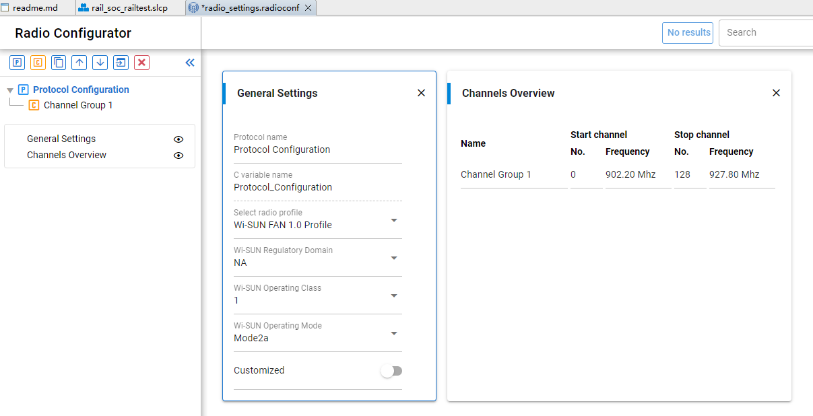

SUN FSK 的调制方式
=================

依旧使用 RAILtest 工具测试 wisun 1.0 fsk 相关的东西.

在 RAILtest 项目中, 初始化配置里面有一项 Wi-SUN Operating Mode, 鼠标悬停之后会有一个
'!', 点击之后能够弹出更多的帮助信息:


在帮助信息中可以看到通道信息:


本次来探讨不同 symbol rate 对波形调制的影响. 本次使用 Wi-SUN Operating Class 1下的
Mode1b 和 Mode2a 来对比. 使用 RAILtest 设置 `settxlength 4` 发送 4 字节数据:

```console
> rx 0
{{(rx)}{Rx:Disabled}{Idle:Enabled}{Time:27570001}}
> setpowerconfig RAIL_TX_POWER_MODE_SUBGIG_POWERSETTING_TABLE 3600 10
{{(setpowerconfig)}{success:true}{mode:RAIL_TX_POWER_MODE_SUBGIG_POWERSETTING_TABLE}{modeIndex:0}{voltage:3600}{rampTime:7}}
> setpower 140
{{(setpower)}{powerLevel:255}{power:140}}
> setchannel 64
{{(setchannel)}{channel:64}}
> settxlength 4
{{(settxlength)}{TxLength:4}{TxLength Written:4}}
> set802154phr 1 0 1
{{(set802154phr)}{PhrSize:2}{PHR:0x6010}}
{{(set802154phr)}{len:4}{payload: 0x10 0x60 0x11 0x22}}
> rx 1
{{(rx)}{Rx:Enabled}{Idle:Disabled}{Time:57045348}}
> tx 2
{{(tx)}{PacketTx:Enabled}{None:Disabled}{Time:72530977}}
```

使用 hackrf 抓到的两种模式下的数据存放在 [sdr](./sdr/railtest/)文件夹下.

# Mode symbol rate

在 URH 的 demodulated 数据中, 可以通过 FFT 明显的看出 2-FSK 调制下的两个频率的信号.
接收端按照 UART 的那种方式, 按照时间片进行采样. 有时候 URH Autodetect parameters
自动计算的 Samples/Symbol 数值不是很准, 可以手动计算两个最小脉冲之间的采样个数填入.


通过上面的 FFT 图形可以计算出, mode1b 模式下的单比特时间是 20us, 对应波特率是 50K,
mode2a 模式下的单比特时间是 10us, 对应的波特率是 100K, mode4a 单个比特时间是 5us,
对应波特率 200K.

通过 SDR 测量计算出来的数值与 RAILtest 的数值一致.

# Bit-to-symbol mapping

802.15.4 规范中做了如下的定义:


根据这个公式, mode1b 和 mode2a 的 fdev 是 25KHz, mode4a 模式下是 50KHz.

使用 RAILtest 工具, 设置模式为 1b, 选择 channel 0, 通过 settxstream 1 持续发送,
在 gqrx 上抓到的频谱图如下:


左边的频率是 902.166M, 右边的频率是 902.217M, 两者的差值是 51K, 与数据能够吻合.
