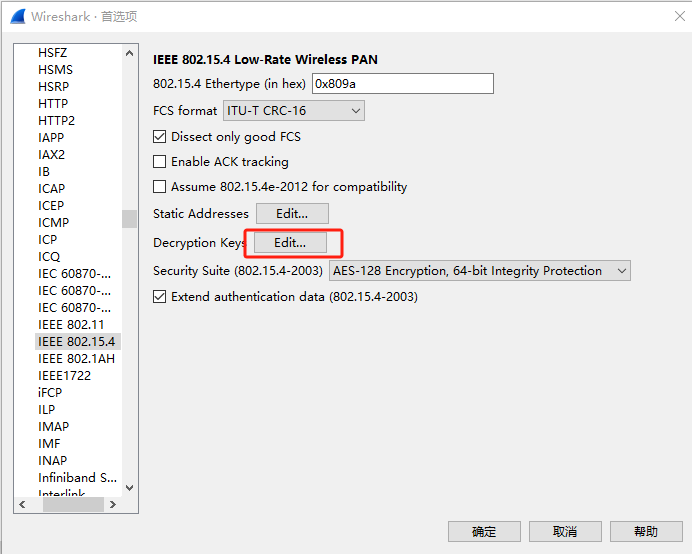
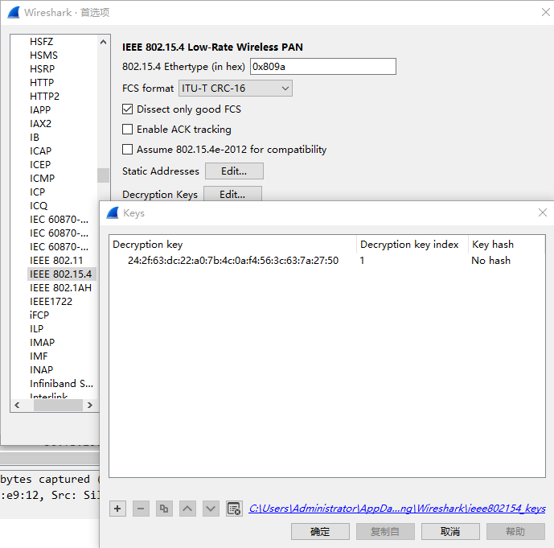
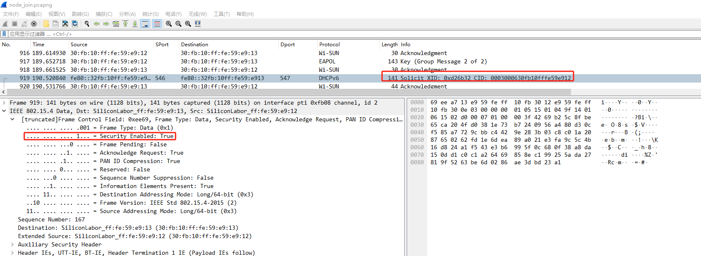

入网流程
=======

使用 wisun-br-linux 做 root, 在其 PTI 接口上抓取 node 入网流程的数据.

记录当时的一些秘钥:

```
pmk = 61:9b:e1:9c:78:3e:af:1e:e9:50:df:4f:0c:c2:26:30:30:ab:69:97:97:f7:cc:e0:ed:a3:5f:84:01:ff:5c:45
pmk.lifetime = 1711528690
pmk.replay_counter = 5
ptk = c7:be:60:74:90:bb:07:16:3a:d8:52:d2:63:cf:c6:6b:03:49:14:41:94:68:16:55:ec:5a:b1:d8:f8:45:11:09:7e:86:1e:f6:48:e1:64:46:d1:68:92:f1:bb:a2:90:c5
ptk.lifetime = 1706344691
gtk[0].installed_hash = 0c:c9
lgtk[0].installed_hash = 20:39
node_role = ffn-fan11
```

GTK/GAK秘钥可以通过 wsbrd 的 SDBUS 接口读取:

```console
$ ./wsbrd_shell.out print Gtks
Gtks                      [0]: 46:1d:43:5d:6f:a2:09:94:28:7b:10:86:32:fc:f6:ff
                          [1]: 00:00:00:00:00:00:00:00:00:00:00:00:00:00:00:00
                          [2]: 00:00:00:00:00:00:00:00:00:00:00:00:00:00:00:00
                          [3]: 00:00:00:00:00:00:00:00:00:00:00:00:00:00:00:00
$ ./wsbrd_shell.out print Gaks
Gaks                      [0]: 24:2f:63:dc:22:a0:7b:4c:0a:f4:56:3c:63:7a:27:50
                          [1]: 26:1b:ac:fe:97:e5:2e:f1:3a:e5:d9:af:38:c2:0f:f3
                          [2]: 26:1b:ac:fe:97:e5:2e:f1:3a:e5:d9:af:38:c2:0f:f3
                          [3]: 26:1b:ac:fe:97:e5:2e:f1:3a:e5:d9:af:38:c2:0f:f3
```

这个秘钥用于解密 ROOT 与 NODE 的通信数据, 可以导入到 wireshark 中使用.

依次点击编辑 -> 首选项, 在左侧的 Protocol 中找到 IEEE 802.15.4 并选中, 之后点击
Decryption Keys Edit:



在打开的界面中, 粘贴上面的 GAK 秘钥, 并且 Decryption key index 设置为 1, 之后点击
OK 即可.



设置完秘钥之后, 一些加密数据能够被 wireshark 解析:


