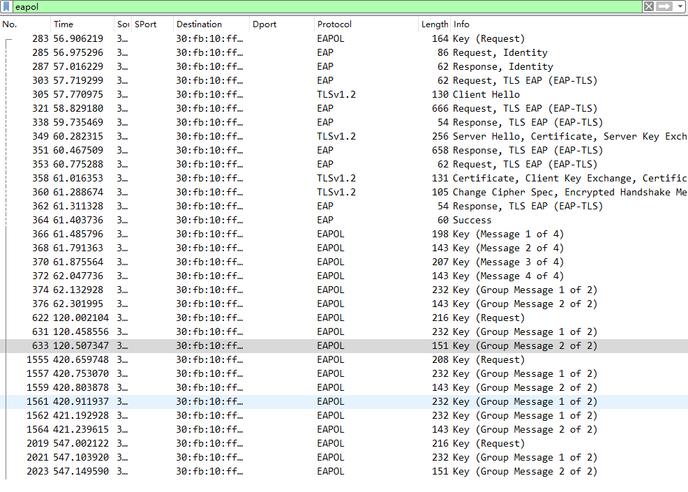
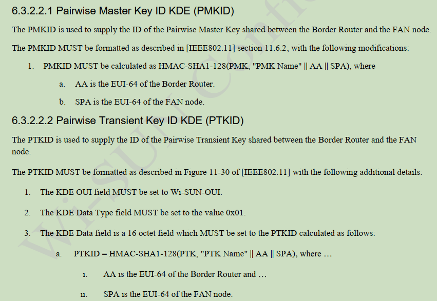

20231206
========



修改代码在程序运行时打印出 master_secret 秘钥的数值:

```
master_secret=8c6aa4b070e767e90dafd6c7097933a4932fe63a3e5c3a2123fe0fe192facd82c91586892f0aa2cb8c7724d55db4ba22
```

从 wireshark 中拷贝出的随机数:

```
clientRandom=6c1cd9f9cd60c75cad9e2c2a1b0ae08fb8ca0d46d28d69af541edb7c0107b7c8
serverRandom=6570a1626b21eede5fd9c774ce7bda58baf47db2327540dfddfffff92ae3f1db
```

# PMK

计算 `Key_Material`:

```
Key_Material = TLS-PRF-128(master_secret, "client EAP encryption",
                           client.random || server.random)
```

```console
$ ./prf.out -a tls12 -b 1024 \
        --key "0x$master_secret" \
        --prefix "client EAP encryption" \
        --data "0x$clientRandom$serverRandom"
0xdbe04e2726dc6b36ea360caa8dd94b7e
0xc4c73f2b508ac0b3606387cfc3d9f992
0x93a1b40b428f4d04c6c6e4cc2a59bdf7
0xd226c3844666463be77503e207fef198
0xb97d5d9d4b2bca5f6ff21ff8cb3745a3
0x15697f666b368422f2dae9733cebead0
0x2422f9a45f569602eae618c45d0b1c07
0x28f69599f75e4719848385541e2411f0
```

其中 Key_Material 的前 32 字节是 PMK:

```
pmk=dbe04e2726dc6b36ea360caa8dd94b7ec4c73f2b508ac0b3606387cfc3d9f992
```

# PTK

参考 [秘钥](../../key/README.md) 一节中关于 PTK 的计算方式.

从四步握手的第一步和第二步提取两个 Nonce 和 MAC 地址:

```
Anonce=a6b6152ab7018c93513a6ecb5e64178f90a5b38938930190af52e070f762cc65
Snonce=784d25e4a10e56d72a47d8e40eedd5434bac419b167f369ca362fc6406a1c91e
AA=30:fb:10:ff:fe:59:e9:13
SPA=30:fb:10:ff:fe:59:e9:12
```

计算 PTK:

```console
$ ./prf.out -b 384 \
	--key "0x$pmk" \
	--prefix "Pairwise key expansion" \
	--data "0x$SPA$AA$Snonce$Anonce"
0xc04e830e5552f832ba6bd4b67abe5e41
0xd9a24527f0c22f0b7a60b7203a104bc8
0x1d8a6517bc60a5e4c9d1266b5976d05f
```

将 PTK 拆分成三部分, 于是得到:

```
PTK=0xc04e830e5552f832ba6bd4b67abe5e41d9a24527f0c22f0b7a60b7203a104bc81d8a6517bc60a5e4c9d1266b5976d05f
KCK=0xc04e830e5552f832ba6bd4b67abe5e41
KEK=0xd9a24527f0c22f0b7a60b7203a104bc8
 TK=0x1d8a6517bc60a5e4c9d1266b5976d05f
```

# 从四步握手的第三步拿到 GTK

四步握手的第三步(wireshark中第370包)进行GTK交换, 将数据提取出来:

```
c06ba39f240fad5014bb4d5f287b2ecc8c1d928f3a8812dc1d15781e9a611d37b953c97443733d26f2c89c96546f92de42d2fcf5248df959
```

这是使用 AES-128-KW 进行封装的秘钥, 参考 [RFC3394](../../aes/RFC3394.md) 进行解密:

```console
$ ./aes.out --key $KEK \
        --unwrap \
        "0xc06ba39f240fad5014bb4d5f287b2ecc8c1d928f3a8812dc1d15781e9a611d37b953c97443733d26f2c89c96546f92de42d2fcf5248df959"
dd16000fac010000461d435d6fa20994287b108632fc1234dd08000fac0700278cb4dd050c5a9e0201dd000000000000
```

按照 [EAPOL KEY DATA](../../wireshark/eapol_key_data.md) 的格式进行拆分:

```
dd 16 000fac 01 0000 461d435d6fa20994287b108632fc1234
dd 08 000fac 07 00278cb4
dd 05 0c5a9e 02 01
dd 00 0000000000
```

从中可以得到 GTK 是 `461d435d6fa20994287b108632fc1234`, GAK 是通过 GTK 转换而来的,
参考公式 [秘钥](../../key/README.md):

```console
$ ./hash.out --sha256 'Wi-SUN Network' 0x461d435d6fa20994287b108632fc1234
6ddf3394626aa324128fbedd83458f198fbbbc1084fbe35bede31a7cb2b14d7e
```

从计算结果中取前128bit作为 GAK: `6ddf3394626aa324128fbedd83458f19`

# LGTK

wireshark 中的第 374 包 (Group Message 1 of 2) 传递了 LGTK, 同样将数据解密:

```console
$ ./aes.out --key $KEK \
        --unwrap \
        "0xf96bb24880480b1aead89e12e96e00d7d3a24e26cba048b1f53a262068bbc70dc1ed80936e82afc1462c8946ace05243e94031e94c1789fb"
dd160c5a9e05000037b47fe82149ee7c69e96d1f70443318dd08000fac070076a6b3dd050c5a9e0401dd000000000000
```

拆分:

```
dd 16 0c5a9e 050000 37b47fe82149ee7c69e96d1f70443318
dd 08 000fac 070076a6b3
dd 05 0c5a9e 0401
dd 000000000000
```

可以提取 LGTK `37b47fe82149ee7c69e96d1f70443318`

# NODE 请求秘钥更新

wireshark 中第 622 包, NODE 发起了一个 Key Request, 并且 Key Data 部分是明文,
将数据进行拆分之后如下:

```
dd 14 000fac 04 f67c40a8037c203fae2d2dc2a0392999 # pmkid kde
dd 14 0c5a9e 01 ed6e5e19d8b3cb6b467eb4e750e58fcb # ptk id
dd 05 0c5a9e 02 01
dd 05 0c5a9e 03 01
dd 05 0c5a9e 04 00
```

`Key Request` 数据中包含了 `pmkid kde` 和 `ptk id`, 这两个数据的计算在 Wisun 标准
中定义:



在当前的场景下计算下这两个数值:

```console
$ ./hmacsha1.out "0x$pmk" "PMK Name" "0x$AA" "0x$SPA"
f67c40a8037c203fae2d2dc2a0392999d6177d64
$ ./hmacsha1.out "$PTK" "PTK Name" "0x$AA" "0x$SPA"
ed6e5e19d8b3cb6b467eb4e750e58fcbe4d893f1
```

HMAC-SHA1 的输出是 20 字节的, 上面的两个 ID 都只取了前 16 字节.

当 BR 收到 Key Request 之后, 使用 Group Message 两步握手重新下发:

```console
$ ./aes.out --key $KEK \
        --unwrap \
        "0x054ec957bbe386dff2efd9b0ee61a297838ebdc02c14c5ac29c1dc92101e6abe24ef91e7010e4eb9390e3adc272ecfcf018ebe782c899961"
dd160c5a9e05000037b47fe82149ee7c69e96d1f70443318dd08000fac070076a67add050c5a9e0401dd000000000000
```

```
dd 16 0c5a9e 050000 37b47fe82149ee7c69e96d1f70443318
dd 08 000fac 070076a67a
dd 05 0c5a9e 0401
dd 00 0000000000
```

第 1555 包也发送了 `Key Request`:

```
dd 14 000fac 04 f67c40a8037c203fae2d2dc2a0392999 # pmkid kde
dd 14 0c5a9e 01 ed6e5e19d8b3cb6b467eb4e750e58fcb # ptk kid
dd 05 0c5a9e 02 00
dd 05 0c5a9e 03 01
dd 05 0c5a9e 04 00
```

第 1557 包 BR 重新发送:

```console
$ ./aes.out --key $KEK \
        --unwrap \
        0x4266c46e4741c08e4a17671057fa66b54069602516c3a1588e34e17efd0e3fe01247c664666f23881d3f51b0e6c61a52cb64fcadbcc5cce3
dd16000fac010000461d435d6fa20994287b108632fc5678dd08000fac0700278c49dd050c5a9e0201dd000000000000
```

从解析的结果看, BR 这边的 GTK 发生了变化.

```
dd 16 000fac 010000 461d435d6fa20994287b108632fc5678
dd 08 000fac 0700278c49
dd 05 0c5a9e 0201
dd 000000000000
```