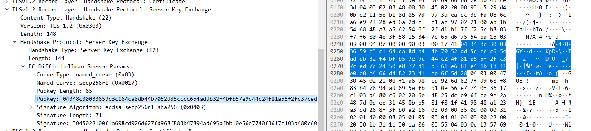
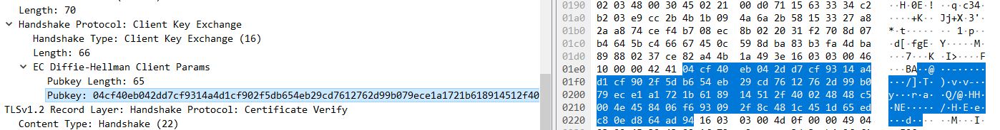

使用ECDH生成联合秘钥
===================

参考 [EC](../../asymmetric/ec/README.md) 椭圆算法一节中介绍的 ECDH 的内容, 本次
使用 wireshark 抓取了一个 tls 阶段的报文, 并修改了 BR 端的程序, 将 ECDH 交换阶段
使用的随机数打印出来, 使用的随机数是:

```
ecdh_random=0x422b2f53a90e2f1865745de43226c0a8871a19a4e946f61d85d6291a320158c3
```

两边协商使用的椭圆曲线是 prime256v1, 计算下 BR 端使用该随机数生成的坐标:

```console
$ ./ec.out prime256v1 -n $ecdh_random
(0x348C30033659C3C164CA8DB44B7052DD5CCCC654ADDB32F4BFB57E9C44C24F81, 0xA55F2FC37CED7C2450E877D1B361E68FE41BF8F1E0A0E466D4822341EE6F5D28)
```



当 BR 收到 Node 发送来的坐标之后, 再次算一个乘法, 计算出一个坐标, 并且将计算出的坐标
的 X 点当做 `pre_master_secret` 使用.

通过 wireshark 中我们可以找到 Node 发来的坐标:



```
0xcf40eb042dd7cf9314a4d1cf902f5db654eb29cd7612762d99b079ece1a1721b
0x618914512f40024848c5004e458406f693092f8c481c451d65edc80ed864ad94
```

计算出联合秘钥:

```console
$ ./ec.out prime256v1 \
        -m $ecdh_random
        -X 0xcf40eb042dd7cf9314a4d1cf902f5db654eb29cd7612762d99b079ece1a1721b \
        -Y 0x618914512f40024848c5004e458406f693092f8c481c451d65edc80ed864ad94
(0xD57C73EE1D3747733769796AA385AEE761972A207028580E9FB2A29E90CA88F7, 0x79E610CBEBB1D53C46699450AD08FB41A359492397702061E6A7768C4FC00AC7)
```

最终计算的坐标的 X 点当做 `pre_master_secret` 使用.

```
pre_master_secret=0xD57C73EE1D3747733769796AA385AEE761972A207028580E9FB2A29E90CA88F7
```

# 计算 master_secret

参考 RFC5246 TLS1.2 中对 master_secret 的定义:

```
master_secret = PRF(pre_master_secret, "master secret",
                    ClientHello.random + ServerHello.random)
                    [0..47];
```

根据公式进行计算:

```console
clientRandom=5a8f877e8a1c48eaae7cc96a8c2a01244d32d9f49aa5a07b64ae681353e41a6b
serverRandom=658067c9bb0dd4b166f53d73fd1676eb9ff6ebb1dbc0f3551f1920f73dd793cb

$  ./prf.out --algo tls12 -b 384 \
        --key $pre_master_secret \
        --prefix "master secret" \
        --data "0x$clientRandom $serverRandom"
0x6f4ae024179f176ef2117a37b861566f
0xa50ad6424678da1ae75af5f3a13d7e1e
0x063193a2317cf1c96a4aa369618f0b18
```
