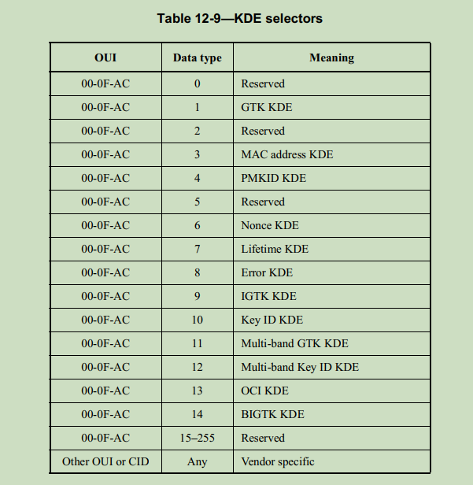

2-way handshake
===============

参考 [wireshark/20231128](./20231128/node_join.pcapng) 的抓包.

在四步握手之后还有两步握手, 用于交换或者更新秘钥.


提取 Key Data 中的加密数据, 按照 [eapol key data](./eapol_key_data.md) 介绍的,
使用 AES-KW 算法进行解密:

```console
$ ./aes.out --unwrap "0xd61dca37fdbd9dd23f733b847aace593532caff714479855d7654b1fd03bcada0084d0d5a948e7b550cee6fabc92cfe05c10a8ccfd9ffedb" --key "0x03:49:14:41:94:68:16:55:ec:5a:b1:d8:f8:45:11:09"
dd160c5a9e05000071bf4eb338bbd790d472c98885abcb17dd08000fac07005b0690dd050c5a9e0401dd000000000000
```

对解密之后的数据进行拆分:

```
    len  OUI   data_type
dd  16  0c5a9e    05       000071bf4eb338bbd790d472c98885abcb17
dd  08  000fac    07       005b0690
dd  05  0c5a9e    04       01
dd  00  0000000000
```



`000fac:07` 是 lifetime KDE, 另外的两个是 WiSUN 1.1 协议中定义的 LGTK, 可以参考
文档: <20150630-Wi-SUN-Assigned-Value-Registry-0v25.docx>


我们解析出来的 LGTK 可以 [wireshark/20231128](./20231128/README.md) 中通过 wsbrd
提取的秘钥匹配.

