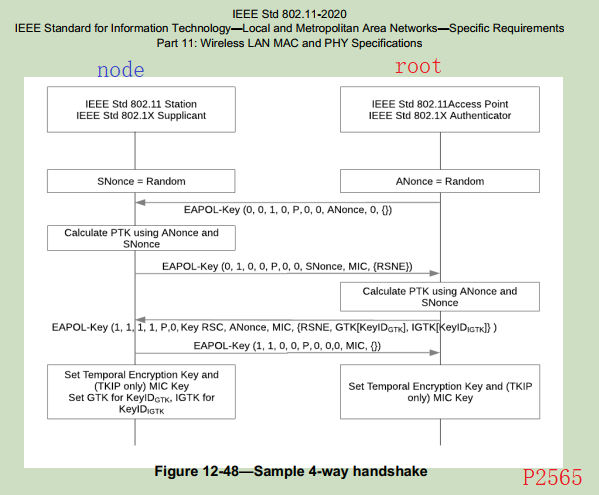
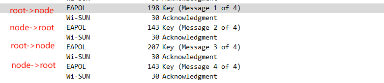

4-Way hankshake
===============

参考文档:

<20130125-FANWG-FANTPS-1v33.pdf> 6.5.2.3 PTK and GTK installation Flow

<ieee 802.11i-2004.pdf>



四次握手是为了 BR 和 NODE 同时安装 PTK 和 GTK 秘钥的. 具体的流程可以参考 wireshark
抓包文件: [20231128/node_join.pcapng](./20231128/node_join.pcapng)



四次握手的过程中, 双方是发送 EAPOL 包. 这个包的格式定义在 <802.11i-2004.pdf> 中:


| 两端的MAC地址 | EUI-64                  |
| ------------- | ----------------------- |
| BR            | 30:fb:10:ff:fe:59:e9:13 |
| NODE          | 30:fb:10:ff:fe:59:e9:12 |

四步握手依赖之前拿到的 PMK 秘钥, PMK是在之前的阶段中生成的, 我们现在不做分析. 数值可以
从头[wsbrd](../wireshark/20231128/README.md) 保存的信息中查看. 本文摘抄数值:

        0x619be19c783eaf1ee950df4f0cc2263030ab699797f7cce0eda35f8401ff5c45

# Message 1 of 4

root 端首先生成一串随机数 ANonce, 并根据 PMK 秘钥和两端的 MAC 地址生成一串 PMKID,
之后将 ANonce 和 PMKID 一同发送发 node.

关于 PMKID 的计算公式, 在 <ieee 802.11i-2004.pdf> 8.5.1.2 Pairwise key inerarchy
和 <20130125-FANWG-FANTPS-1v33.pdf> 6.3.2.2.1 Pairwise Master Key ID KDE(PMKID)
中都有介绍.

        PMKID = HMAC_SHA1-128(PMK, "PMK Name" || AA || SPA)
        AA:  EUI-64 of the Border Router
        SPA: EUI-64 of the FAN node.

使用 [hmacsha1](../hmac/hmacsha1.c) 工具计算下 PMKID:

```console
$ ./hmacsha1.out \
        0x619be19c783eaf1ee950df4f0cc2263030ab699797f7cce0eda35f8401ff5c45 \
        "PMK Name" \
        0x30:fb:10:ff:fe:59:e9:13 \
        0x30:fb:10:ff:fe:59:e9:12
9556db7aeccbb2b9c2301c116e542fe69ee3548c
```

我们通过 hmacsha1 工具计算出的 PMKID 与 wireshark 中的结果一致.

| root -> node                   |                                                              |
| ------------------------------ | ------------------------------------------------------------ |
| Border Router generated ANonce | ba34556e833c458b72ba11762cd44d3fb535ab04e323d33d45420f510758c0a7 |
| PMKID                          | 9556db7aeccbb2b9c2301c116e542fe6                             |

# Message 2 of 4

在第二阶段的时候, node 已经收到了 root 发送来的 ANnoce, 其自身同样会生成一个 SNonce,
在本次抓包中生成的随机数是:
`3705c07bf3c7fe08b102a267083d6f94139a6722fb41cadef0d2747db1f851f2`

在 [prf](../ieee80211i_prf/README.md) 一节中已经介绍过 PRF 算法, PTK 秘钥是使用
PRF-384 生成的伪随机数. 公式是:

```
PTK = PRF-384(PMK, "Pairwise key expansion",
                MIN(BR EUI-64, NODE EUI-64) ||
                MAX(BR EUI-64, NODE EUI-64) ||
                MIN(ANonce, SNonce) ||
                MAX(ANonce, SNonce))

式中的 || 符号表示数据拼接.
```

将我们上面统计的数据按照 EUI-64.min EUI64.max, Nonce.min, Nonce.max 排序:

| 类型      | 数值                                                         |
| --------- | ------------------------------------------------------------ |
| EUI64.min | 30fb10fffe59e912                                             |
| EUI64.max | 30fb10fffe59e913                                             |
| Nonce.min | 3705c07bf3c7fe08b102a267083d6f94139a6722fb41cadef0d2747db1f851f2 |
| Nonce.max | ba34556e833c458b72ba11762cd44d3fb535ab04e323d33d45420f510758c0a7 |

使用我们编写的 prf 程序计算:

```console
$ ./prf.out \
        --bit 384 \
        --key \
        '0x619be19c783eaf1ee950df4f0cc2263030ab699797f7cce0eda35f8401ff5c45' \
        --prefix "Pairwise key expansion" \
        --data \
        '0x30fb10fffe59e912:\
        30fb10fffe59e913:\
        3705c07bf3c7fe08b102a267083d6f94139a6722fb41cadef0d2747db1f851f2:\
        ba34556e833c458b72ba11762cd44d3fb535ab04e323d33d45420f510758c0a7'
0xc7be607490bb07163ad852d263cfc66b
0x0349144194681655ec5ab1d8f8451109
0x7e861ef648e16446d16892f1bba290c5
```

我们这边通过 prf.out 计算出的 PTK 秘钥, 可以与 wsbrd 中记录的数据吻合.

NODE 端计算出 PTK 秘钥之后, 将自己生成的 SNonce 发送给 ROOT, 这是 ROOT 也已经有了
计算 PTK 的全部信息, 它按照同样的 PRF-384 算法可以计算出同样的 PTK 秘钥. PTK 是一组
秘钥, 关于其信息可以查看 [key](../key/README.md)

