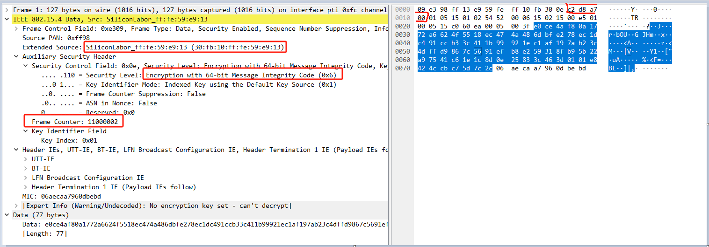
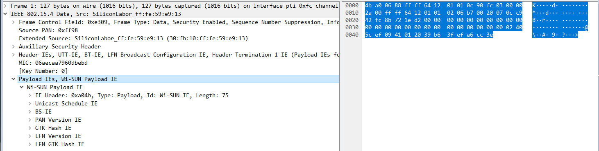

Data Encrypt
============

讨论下 WiSUN 技术中的数据加密.

使用 wireshark 打开 [20231128/node_join.pcapng](./20231128/node_join.pcapng)
文件, 删除掉之前已经导入到 wireshark 中的秘钥, 禁止 wireshark 自己解密.

选择第一包PC帧进行分析. 在之前我们也知道 PC 帧是经过加密的.



从明文包头中可以得到这些有用的数据:

        Source: 0x30fb10fffe59e913
        Frame Counter: 11000002 (0x00a7d8c2)
        Security Level: Encryption with 64-bit Message Integrity Code (0x6)

将全部数据复制出来, 按照包头 + 密文 + MIC 的格式分组:

```
09e398ff13e959feff10fb300ec2d8a70001051501025452000615021500e501000515c060ea0005003f
e0ce4af80a1772a6624f5518ec474a486dbfe278ec1dc491ccb33c411b99921ec1af197ab23c4dffd9867c5691efb8e259318fb95b22a97541c61e1c8d0e25833c463d0101e8424ccbc75d7c2c
06aecaa7960dbebd
```

WiSUN 对数据加解密的秘钥是 GAK, 可以在 [秘钥](../key/README.md) 一节中看到.

根据 [IEEE802154_AES_CCM](../aes/IEEE802154_AES_CCM.md) 中的介绍, 使用 aes.out
工具进行解密及校验:

```console
./aes.out --invccm \
    --Tlen 64 \
    --key "0x242f63dc22a07b4c0af4563c637a2750" \
    --nonce "0x30fb10fffe59e913:00a7d8c2:06" \
    --adata "0x09e398ff13e959feff10fb300ec2d8a70001051501025452000615021500e501000515c060ea0005003f" \
    "0xe0ce4af80a1772a6624f5518ec474a486dbfe278ec1dc491ccb33c411b99921ec1af197ab23c4dffd9867c5691efb8e259318fb95b22a97541c61e1c8d0e25833c463d0101e8424ccbc75d7c2c06aecaa7960dbebd"
4ba00688ffff641201010c90fc0300002a00ffff641201010206b70020070cc942fc8b721ed200000000000000000000000000000000000000000000000002405cef0941012039b63fefa6cc3e
```

可以看到数据被正确的解密, 并且 MIC 校验成功. 这个数据与我们在 wireshark 中配置秘钥,
自动解密出来的数据一致:


