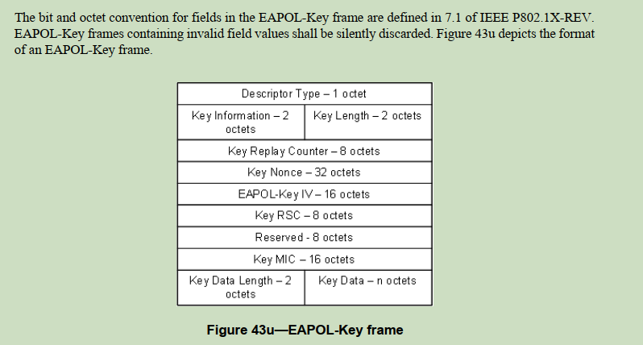
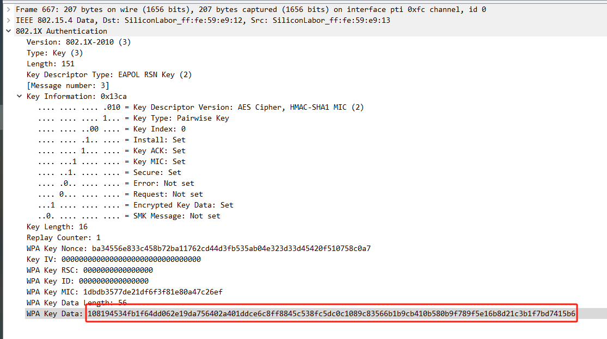
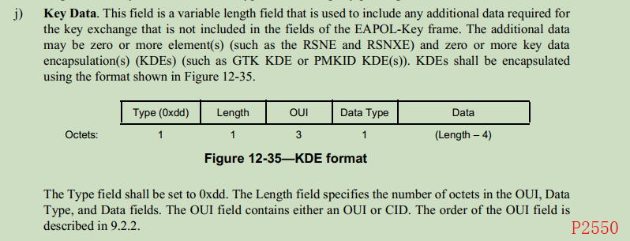
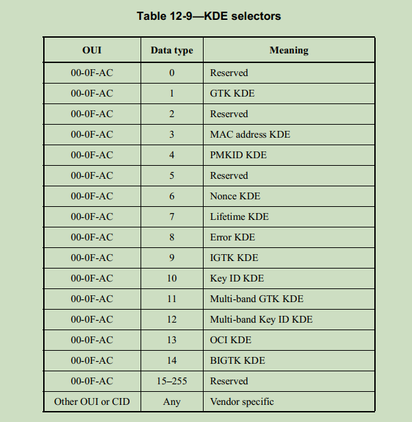
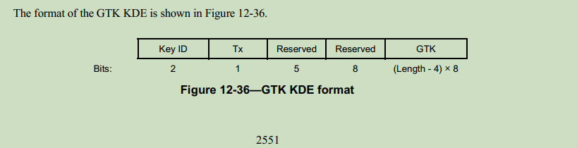
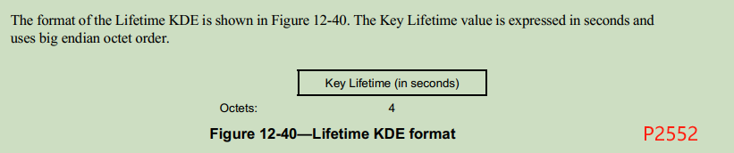
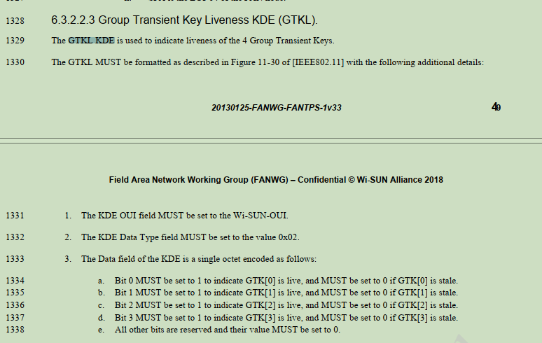

EAPOL Key Data
==============

参考文档: <ieee 80211-2020.pdf>

在之前的介绍中, 提到过 EAPOL-Key 的格式, 也知道这个帧是用于交换秘钥的. 秘钥自然不能够
明文传输, 因此将秘钥按照一定的算法打包之后, 塞进Key Data这个结构中.



在之前的介绍中, 我们也在 wireshark 中看到了这个数据:



这个数据是按照 AES-Key wrap 的方式包装的, 可以参考:
[RFC3394](../rfc3394/README.md), 在那个文档中, 我们对 wireshark 中抓到的数据做了
解包, 可以知道发送前的明文数据是:

```
dd16000fac010000461d435d6fa20994287b108632fcf6ffdd08000fac0700278c6cdd050c5a9e0201dd000000000000
```

下面我们对这串明文数据的格式进行讨论.

# KDE format

可以在 80211-2020.pdf 文档中找到Key Data的格式定义:




按照这种格式, 对我们的数据进行拆分:

```
     len   OUI    data type  data
dd    16   000fac    01      0000461d435d6fa20994287b108632fcf6ff
dd    08   000fac    07      00278c6c
dd    05   0c5a9e    02      01
dd    00
0000000000
```

拆分后可以看到上面有三种不同类型的数据. 前面两行分别是 GTK KDE, Lifetime KDE.
第三行不是 IEEE 80211-2020 中的定义, 暂时不管.

# GTK KDE

GTK KDE 的定义如下:



对上面的数据再次进行拆分:

```
keyid   reserved    GTK
  00       00       461d435d6fa20994287b108632fcf6ff
```

这样就可以看到 ROOT 端发送给 NODE 端的 GTK 秘钥了. 这个数据与我们通过 wsbrd 中提取的
数据是一致的. [wsbrd](../wireshark/20231128/README.md)

# Lifetime KDE

lifetime KDE 是一个 4 字节的数字, 表示秒数.



0x00278c6c = 2591852 ~ 720h ~ 30 day

# WISUN GTKL

0c5a9e 是 WISUN OUI, 后面跟随的数据是 GTKL, 具体的定义可以在 WISUN 的协议中找到.



```
dd    05   0c5a9e    02      01
```

最后的 01 表示仅有 GTK[0] 有效.
