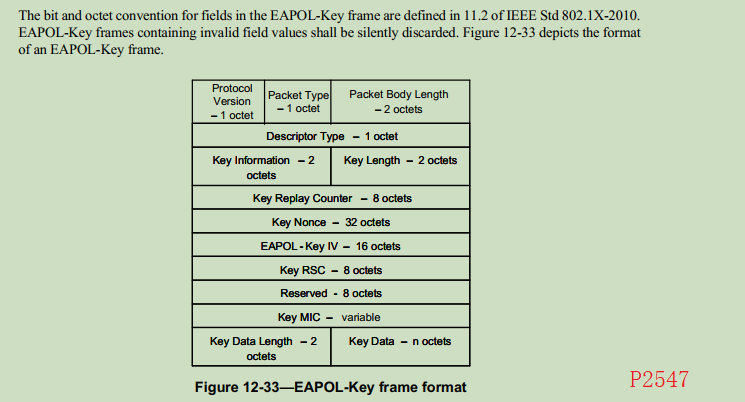

EAPOL-KEY帧中的MIC
=================

EAPOL-Key 是用于 ROOT 和 NODE 之间进行秘钥安装的帧, 他的格式如下:



MIC(message integrity code)消息完整性代码, 是位于 EAPOL-Key 中的一个字段, 占用 16
字节, 用于对 EAPOL-Key 进行完整性和合法性校验. 关于 MIC 的计算方法, 有两个版本,
在 [wireshark/20231128](./20231128/node_join.pcapng) 文件中, 可以看到 wsbrd 使用
的方式是SHA1.


从计算方式可以看到 MIC 其实就是基于 SHA1 的 [HMAC](../hmac/README.md), 正常的 SHA1
HMAC 的输出长度是 160 字节, EAPOL-Key 中只取了前 128 字节.

在 [key](../key/README.md) 一节中我们介绍过 PTK, 也知道 PTK 内部包含了三组秘钥,
这个 MIC 计算使用的秘钥是 PTK.KCK, 在当前抓包的文件中是
`0xc7be607490bb07163ad852d263cfc66b`

将 wireshark 中 `802.1X Authentication` 的原始数据复制出来:

```
                        0303005f
02010a000000000000000000003705c0
7bf3c7fe08b102a267083d6f94139a67
22fb41cadef0d2747db1f851f2000000
00000000000000000000000000000000
00000000000000000000000000f75f9b
8e4f8297058d8ffbf66fcd212d0000
```

清零数据中 MIC 的部分:

```
                        0303005f
02010a000000000000000000003705c0
7bf3c7fe08b102a267083d6f94139a67
22fb41cadef0d2747db1f851f2000000
00000000000000000000000000000000
00000000000000000000000000000000
000000000000000000000000000000
```

之后我们重新计算下 MIC:

```console
$ ./hmacsha1.out \
        0xc7be607490bb07163ad852d263cfc66b \
        '0x0303005f \
        02010a000000000000000000003705c0 \
        7bf3c7fe08b102a267083d6f94139a67 \
        22fb41cadef0d2747db1f851f2000000 \
        00000000000000000000000000000000 \
        00000000000000000000000000000000 \
        000000000000000000000000000000'
f75f9b8e4f8297058d8ffbf66fcd212d3af7028d
```

可以看到数据与我们wireshark抓包中的MIC数据吻合.
