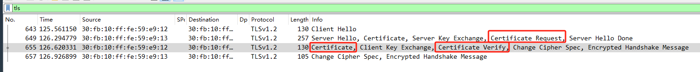
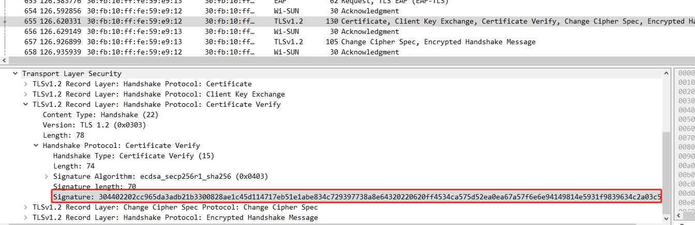
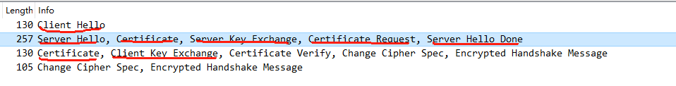
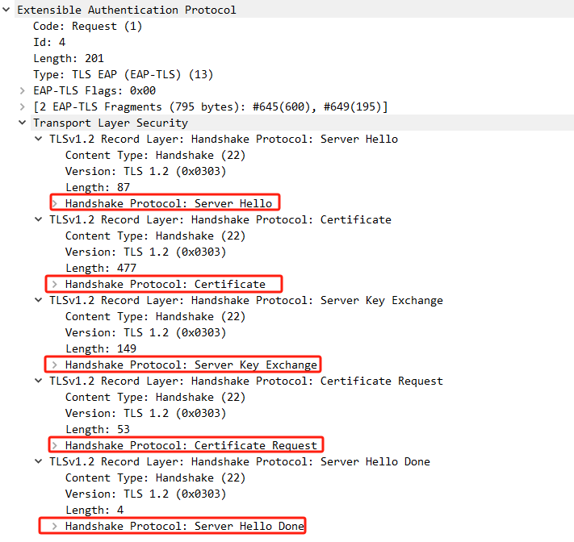

TLS Client Certificate Verify
=============================

查看 [wireshark/20231128](../wireshark/20231128/node_join.pcapng) 抓包文件, 过滤
TLS 数据包, 可以看到这样的几个数据帧:



服务器可以发送 `Certificate Request` 申请客户端的证书, 证书里面仅包含客户端的公钥,
如何才能证明这个证书确实是客户端的呢, 最简单的方式就是客户端对一串数据做签名, 服务器
使用证书中的公钥做验证.

客户端将这个签名数值放在 `certificate Verify.Signature` 中:


将签名数值提取出来:

```console
$  echo 304402202cc965da3adb21b3300828ae1c45d114717eb51e1abe834c729397738a8e64320220620ff4534ca575d52ea0ea67a57f6e6e94149814e5931f9839634c2a03c51c86 \
        | xxd -r -p > 1.sign
```

根据 RFC4346 的定义, 签名的数据源是:

```
Here handshake_messages refers to all handshake messages sent or
received starting at client hello up to but not including this
message, including the type and length fields of the handshake
messages. This is the concatenation of all the Handshake structures,
as defined in 7.4, exchanged thus far.
```

从 wireshark 中看, 是划线的几部分:


并且数据源是每一个 `TLS Record Layer` 中的 `Handshake Protocol` 部分:



将数据提取出来:

```console
$ clientHello=010000430303248117040b044a8c10129f706e10d02a0d8aa4bbe850caf24774dc27313c0284000004c0ae00ff01000016000a000400020017000d000400020403000b00020100
$ serverHello=0200005303036565a6f1f88b9a68a37c3260cf00ee498f1ea1c3cdd91f04d9aebae0d120fdd820b7b3f017c4d37b8affd8ad97c11becf9a08d76fbb35b8dbcbd1aa053152a9f7cc0ae00000bff01000100000b00020100
$ serverCert=0b0001d90001d60001d3308201cf30820175a003020102021457dad6717c03a911ab2d553f2518a97ffab90115300a06082a8648ce3d040302301e311c301a06035504030c1357692d53554e2044656d6f20526f6f742043413020170d3231303330313037343231385a180f39393939313233313233353935395a30243122302006035504030c1957692d53554e2044656d6f20426f7264657220526f757465723059301306072a8648ce3d020106082a8648ce3d030107034200046a8102c078ec66c4a596cede20cd69778df52d80123305506cb3a18be8560fd750d847e59e3a7a854522df3ffad7de23d5216b6c63d0a2a2f42af74341263faaa38188308185300e0603551d0f0101ff04040302038830210603551d250101ff0417301506092b0601040182e4250106082b06010505070301302f0603551d110101ff04253023a02106082b06010505070804a015301306092b0601040182b741010406313233343536301f0603551d230418301680149364d40ef768a2ee5df0acfa72bcc51f4d4f3a24300a06082a8648ce3d040302034800304502200093e529d40be2115eb18d857d973aeaec3efa066ca6e92f28ed6a2dcfc1ac97022100ab1b546848a3a562546f2fd1b17ff25cb803f7f6804e3f5815347e65d67554ba
$ serverKE=0c0000910300174104c782cae22bdf76cd7d8264fc4648c7b00cf6269f8c7102e807e5a1b86bc9c21c3aaa14db586a015852101419da7c48658d953067d271d9812921e658163366b2040300483046022100840caf00f162b8685d705d366d157981b9aedb36eb57eda3b313ad76bd8699430221009c882e88536a5c39708a9164782aa1d4d7dda903bf7fcee0bbca1f9e1f2ba981
$ serverCertReq=0d0000310201400008050105030401040300220020301e311c301a06035504030c1357692d53554e2044656d6f20526f6f74204341
$ serverHelloDone=0e000000


$ clientCert=0b0001d20001cf0001cc308201c83082016ea00302010202143d1b6b15c03a770d37b13a43d5d02b1e9162eb98300a06082a8648ce3d040302301e311c301a06035504030c1357692d53554e2044656d6f20526f6f742043413020170d3231303330313037343234305a180f39393939313233313233353935395a301d311b301906035504030c1257692d53554e2044656d6f204465766963653059301306072a8648ce3d020106082a8648ce3d03010703420004a8eaabba7877fa002bf376bac2da41f90851bcce28f5d4dd55e342a346a65e1cdb52c172970ece81b82ab6808a420b984ec6e272978b316bf84d5ec9c57e888fa38188308185300e0603551d0f0101ff04040302038830210603551d250101ff0417301506092b0601040182e4250106082b06010505070302302f0603551d110101ff04253023a02106082b06010505070804a015301306092b0601040182b741020406313233343536301f0603551d230418301680149364d40ef768a2ee5df0acfa72bcc51f4d4f3a24300a06082a8648ce3d0403020348003045022100d07115633334c2b203e9cc2b4b1b094a6a2b58153327a82aa874cef4b708ec8b022031f2708d07b4645bc46667450c598dba83b3fa4dba89880237ce82a44b1a493e
$ clientKE=100000424104e4b385383451a12d35aa39906e75c605378d2cc18451350eb3b841d7263a54b11dacad5ba2c16f77e57a8a423414335b3e80cba27a8dcbe08e83d8f738399f95
```

将数据源整理成一个文件, 并验证签名:
(这个地方的client是指wisun的node, 所以使用的公钥是node的公钥)

```console
$ echo $clientHello \
        $serverHello $serverCert $serverKE $serverCertReq $serverHelloDone \
        $clientCert $clientKE \
        | xxd -r -p > 1.bin
$ openssl dgst -sha256 -verify node_pub.pem -signature 1.sign 1.bin
Verified OK
$

签名验证成功. 说明客户端发送的证书无误.
