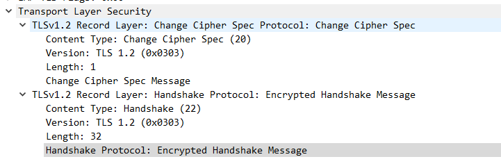
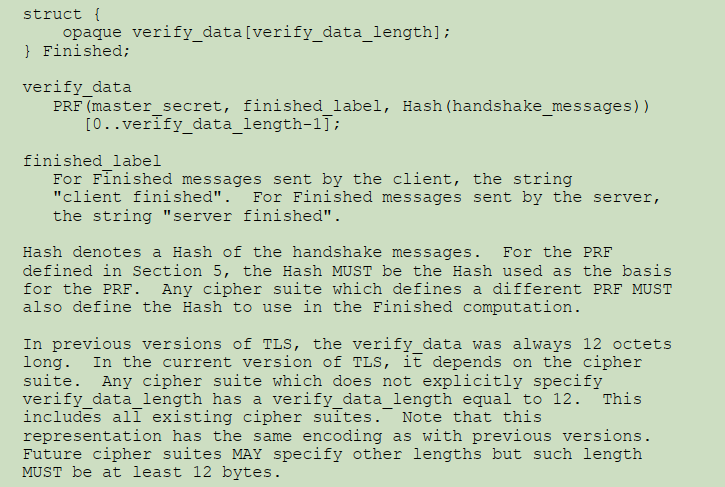

TLS finish
==========

当服务器和客户端完成秘钥交互之后, 他们会发送一份 `Encrypted Handshake Message` 来
检测两边建立的 `master_secret` 秘钥是否相同.



在 TLS 1.2(RFC5246) 中, 定义了 `Encrypted Handshake Message` 的计算公式:



对 handshake_messages 的定义如下:

```
handshake_messages
All of the data from all messages in this handshake (not
including any HelloRequest messages) up to, but not including,
this message. This is only data visible at the handshake layer
and does not include record layer headers. This is the
concatenation of all the Handshake structures as defined in
Section 7.4, exchanged thus far.
```

